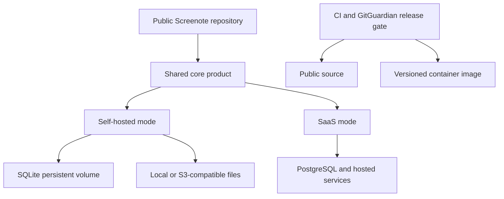
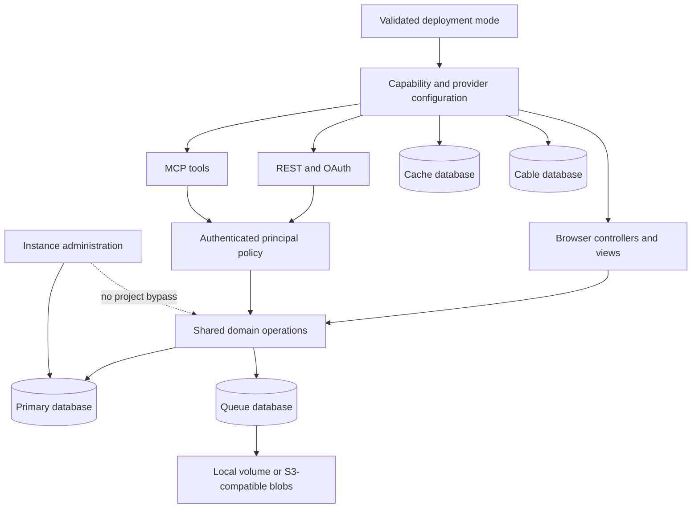
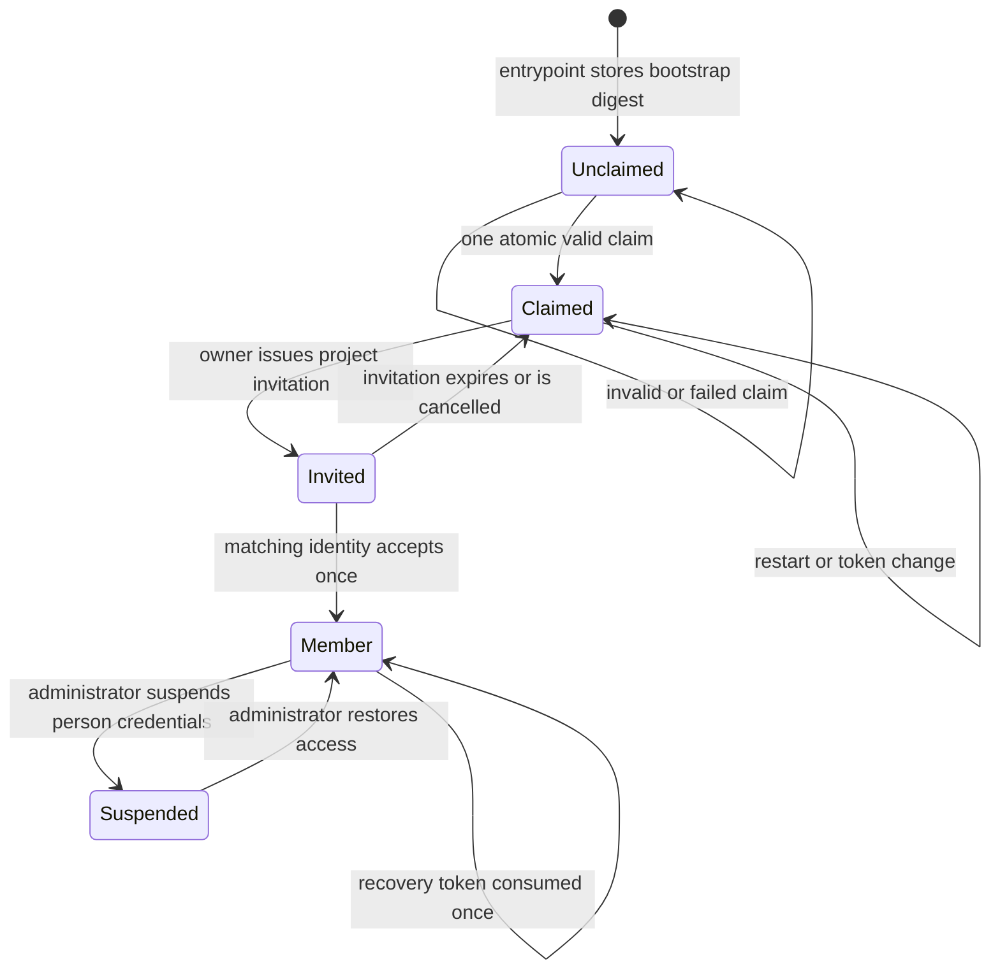
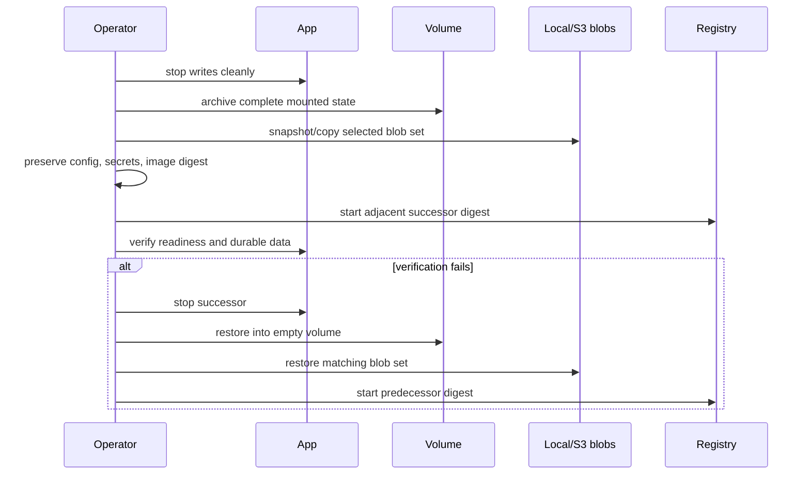
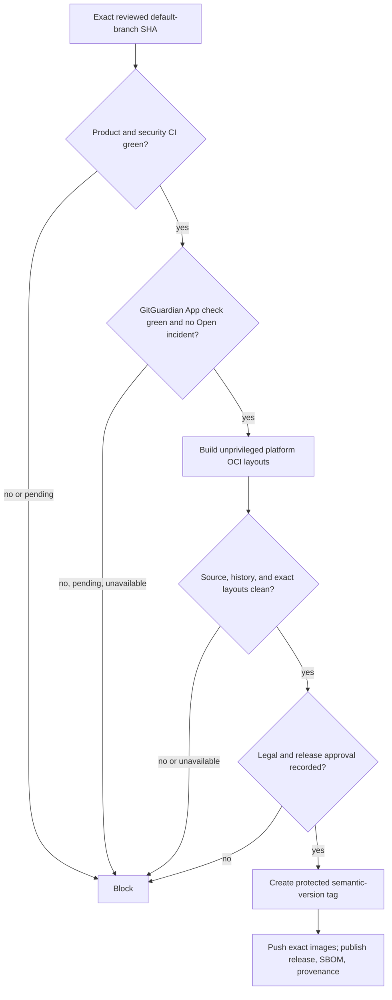

# Screenote Self-Hosted Source Release - Plan

## Goal Capsule

- **Objective:** Release Screenote as a source-available product that a team can run inside its VPN from one Docker container while Future Spin Ltd continues operating `screenote.ai` from the same codebase.
- **Product authority:** This plan defines the first self-hosted Screenote release, its edition boundary, publication gates, and operator experience. It does not define the separate rollout of GitGuardian across other public repositories.
- **Execution profile:** Deep, security-sensitive code work in one Screenote repository PR. The implementation may prepare release automation, but it must not make the repository public or publish a tag or image before the publication gates pass.
- **Authority order:** Repository instructions override this artifact. Within this artifact, the Product Contract owns behavior, the Planning Contract owns implementation mechanisms, and an Implementation Unit cannot override either.
- **Stop conditions:** Stop if implementation evidence invalidates a session-settled decision, if an append-only migration cannot preserve supported SaaS data, or if release preparation would require publishing before legal and secrets approval.
- **Tail ownership:** The autonomous shipping workflow owns implementation, verification, review, commit, push, PR creation, and CI follow-through. A human release maintainer owns legal approval, GitGuardian incident disposition, repository visibility, and final release authorization.
- **Open blockers:** None for local code authoring. GitGuardian App/API authorization and the required repository-incident check block CI-complete PR integration and every default-branch update; legal approval plus the completed full-history/current-tree scan and incident disposition remain publication gates.

---

## Product Contract

The validated Product Contract below is unchanged. The Planning Contract implements it without amending its requirements, actors, flows, acceptance examples, or settled product decisions.

### Summary

Screenote will publish its source under the O'Saasy license and provide a prebuilt, single-container self-hosted edition for private teams. The self-hosted edition is the unlimited core product; the same public repository also carries the explicitly enabled services needed to operate the hosted SaaS.

### Problem Frame

Screenote currently has a production Dockerfile and supports Active Storage on disk or an S3-compatible service, but its production runtime is the `screenote.ai` SaaS runtime. It requires PostgreSQL and Stripe at boot, selects Rabata storage, assumes the Screenote host and HTTPS posture, sends mail through Resend, and identifies the administrator by one hard-coded email address.

That coupling prevents a team from starting Screenote inside a VPN without recreating Future Spin's hosted infrastructure. The repository also lacks a license, self-hosting guide, Compose example, versioned public image workflow, and publication-grade history audit.

### Key Decisions

- **Unlimited self-hosted core.** (session-settled: user-directed — chosen over SaaS plan limits or a paid license key: private deployments must not depend on billing.) Governs R4, R5.
- **One-container default.** (session-settled: user-directed — chosen over an application-plus-PostgreSQL stack or supporting both profiles immediately: straightforward operation is the first-release priority.) Governs R6, R7, R8.
- **Closed, decentralized invitation admission.** (session-settled: user-directed — chosen over open VPN registration or SSO-only access: after bootstrap, each project owner may admit collaborators to that project without separate instance-administrator approval.) Governs R10, R11, R12.
- **Project-scoped authorization.** (session-settled: user-directed — chosen over instance-wide team membership or a hybrid team/project model: an invitation grants access only to its named project.) Governs R11, R12, R24.
- **One public repository.** (session-settled: user-directed — chosen over a private SaaS extension or a stripped release mirror: core and hosted operation should evolve without drift.) Governs R2, R16, R17.
- **Token-secured bootstrap with a narrow singleton administrator.** (session-settled: user-directed — chosen over environment-provisioned credentials or trusting the first visitor: initial ownership must not be claimable by an unintended visitor, while instance-wide recovery must not imply project access.) Governs R10, R28.
- **Explicit core/SaaS classification.** A capability is core when it creates, organizes, reviews, shares, or automates visual feedback; a capability is SaaS-only when its sole purpose is selling or operating Future Spin Ltd's managed `screenote.ai` service. Optional infrastructure integrations do not become SaaS-only merely because they use an external provider. Governs R4, R5, R14, R16.
- **Future Spin Ltd is the intended Original Licensor.** (session-settled: user-directed — publication remains subject to documented chain-of-title and legal approval.) Governs R1.
- **GitGuardian fails closed at every publication boundary.** Existing history, every default-branch update, and every release candidate must clear secrets scanning and incident remediation before publication. Governs R15, R18-R20, R25.

<!-- ce-section: work-relationships -->
### How This Work Fits Together

This plan owns Screenote's source-available release and self-hosted product. The broader breakdown is current context, not a committed roadmap.

- **GitGuardian across other public repositories**
  - Can proceed independently of Screenote's runtime work after the GitGuardian account and GitHub App are authorized.
  - Shares the same historical-scan, credential-revocation, and continuous-monitoring rules as R18-R20.
  - Does not authorize access to private repositories; those require a separate explicit decision.

### Actors

- A1. **Instance operator:** Installs, configures, backs up, upgrades, and restores a self-hosted Screenote instance.
- A2. **Instance administrator:** Atomically claims the fresh instance, handles instance-wide account recovery and access suspension, and may transfer the singleton role; this role neither approves every invitation nor grants access to every project.
- A3. **Project collaborator:** Reviews screenshots, collaborates through annotations, and uses the CLI or agent integrations against the private base URL.
- A4. **SaaS operator:** Runs `screenote.ai` with hosted billing, database, storage, email, OAuth, and monitoring services.
- A5. **Contributor or release maintainer:** Changes the public codebase and publishes releases only after quality and secrets gates pass.
- A6. **Project owner:** Owns a project, manages its members, and issues invitations that grant access to that project only.

### Requirements

**License and public repository**

- R1. Subject to documented verification of chain of title and legal approval before publication, the repository and distributed image must carry the O'Saasy license with the intended notice `Copyright © 2026, Future Spin Ltd.` and Future Spin Ltd identified as the Original Licensor.
- R2. The public repository must contain the shared core and the explicitly enabled SaaS capability without including credentials, private operational data, or production-only secret values.
- R3. Public documentation must consistently describe Screenote as source-available and self-hostable and must explain the license's restriction on directly competing hosted services.

**Edition behavior**

- R4. Self-hosted mode must provide the unlimited core product: projects and project membership; pages, snapshots, screenshots, and multi-viewport images; annotations, replies, and resolution; API keys and the REST API; and CLI/API authorization, MCP, and agent workflows that create, organize, review, share, or automate visual feedback. It must not show billing, upgrade, plan-limit, or Stripe-dependent flows.
- R5. Self-hosted mode must start and remain usable without Stripe credentials or a license key. Stripe, subscriptions, checkout, billing portal and webhooks, plan enforcement and upgrade UI, hosted subscription analytics, and Future Spin/provider-specific production defaults and operations are SaaS-only.
- R6. The supported first-release topology must run the web application, jobs, cache, and collaboration state in one container backed by SQLite.
- R7. One persistent volume must contain every local durable asset needed to stop, replace, and restart the container without data loss.
- R8. The SaaS runtime may continue using PostgreSQL and hosted integrations, but ordinary core behavior must remain compatible with both supported runtime modes.

**Storage and network configuration**

- R9. Local filesystem storage must be the self-hosted default, with S3-compatible storage available through documented endpoint, region, bucket, credential, and path-style settings.
- R10. Before an instance is claimed, every account-creation path except successful bootstrap must be closed. Bootstrap must atomically validate a one-time token, create exactly one persisted instance administrator, and consume the token in one successful transaction. An invalid token must create no account; concurrent valid claims must yield exactly one administrator; and a failed creation must leave the token unconsumed and the instance claimable.
- R11. After bootstrap, every account-creation path, including password and social authentication, must require a valid invitation issued by an owner of the named project; no authentication method may provide open registration or bypass project-scoped admission.
- R12. A project owner must be able to copy an invitation link when SMTP is absent; configured SMTP may deliver the same invitation by email. A new invitee who does not bind an external authentication identity must establish durable local credentials during acceptance and be able to sign out and back in without email delivery.
- R13. The instance base URL, allowed host, and secure-cookie/HTTPS behavior must be configurable for plain HTTP inside a VPN or HTTPS behind a reverse proxy.
- R14. SMTP, social OAuth, S3-compatible storage, and external error monitoring are optional self-host integrations and must be disabled or inert when their credentials are absent. Enabling social OAuth must preserve the bootstrap and invitation rules in R10-R11.

**Packaging and operations**

- R15. Tags and versioned prebuilt container images may be published only from the protected default branch and only after automated quality, GitGuardian, security, migration, and self-hosted smoke checks pass for the exact revision. Every release must have an immutable version tag; moving convenience tags may exist but must not be used for supported upgrades or rollback.
- R16. The same public branch and release must remain deployable in SaaS mode without weakening its billing, PostgreSQL, storage, authentication, or monitoring requirements.
- R17. The self-hosting guide must provide a copyable Docker Compose installation for the supported one-container topology and cover configuration, CLI base URL, health checking, backup, restore, upgrade, rollback, local storage, S3-compatible storage, SMTP, and reverse-proxy operation.

**Secrets and publication safety**

- R18. Before the repository becomes public, GitGuardian must scan its full candidate history and current tree. After publication, the default branch must reject direct pushes and require a successful GitGuardian check for every proposed update; pending, unavailable, or failed checks fail closed.
- R19. Source, tags, and images may publish only when the relevant scan has no Open GitGuardian incident (`Triggered` or `Assigned`). Every confirmed credential must be revoked or rotated regardless of perceived risk and may close as `Resolved` only after that action is documented; an authorized maintainer may close an incident as `Ignored` only for a documented false positive or a non-secret test value proven incapable of authenticating.
- R20. Reviewed history containing a revoked credential may be retained only with documented security and legal approval. History must be rewritten or replaced when a secret cannot be revoked, when it contains protected personal or confidential data or third-party intellectual property, or when reviewers cannot approve retention; publication requires documented legal approval and no known unresolved intellectual-property or licensing issue.
- R21. Release artifacts must not embed runtime secrets, development credentials, private configuration, or build-system tokens.

**Community and support contract**

- R22. The public repository must provide contribution, security-reporting, support-boundary, and release documentation appropriate for outside users and contributors.
- R23. Release notes must distinguish changes that affect self-hosted operators, SaaS operators, stored data, configuration, or upgrade compatibility; name the immediately supported predecessor; and flag irreversible migrations.
- R24. Project content and authorization must remain project-scoped: accepting an invitation provisions or signs in the user and grants membership only in the named project; users, including the instance administrator, may see only projects they own or have joined. The first release must not introduce a global Team entity or implicit all-project access.
- R25. A suspected secret found after publication must immediately block new default-branch updates, tags, and images. Confirmed credentials must be revoked or rotated, affected releases assessed for disclosure, and publication resumed only after the incident is closed under R19.
- R26. The supported upgrade path is sequential between adjacent published releases, and each release must name its immediately supported predecessor. Skipping versions requires following every documented intermediate hop. Immutable images and upgrade/rollback documentation for each link must remain available for as long as that link belongs to a supported upgrade chain.
- R27. Before upgrading, an operator must create one consistent, restorable backup set containing the persistent volume, either the local blobs within it or a corresponding snapshot/copy of S3-compatible objects, and the external configuration and non-derivable secrets required to restore the instance. Rollback means stopping the new image, restoring that exact pre-upgrade backup set, and starting the predecessor's immutable image—never running old code against migrated state—and may lose writes made after the backup boundary.
- R28. Exactly one active instance administrator must exist after bootstrap. That administrator may view account identity/status metadata, suspend or restore account access, revoke sessions, issue single-use expiring local-credential recovery links, and atomically transfer the administrator role to another active account. The current administrator cannot be suspended or removed until transfer succeeds; these powers must not reveal project content or grant project membership. Runtime configuration and secrets remain operator-managed outside the product UI.
- R29. If the instance administrator loses access, an operator with container and volume control must be able to run a documented local-only recovery command that emits a single-use expiring recovery link for the current administrator or atomically transfers the role to an existing active account. Recovery must be audited, must not reopen bootstrap or create a second administrator, and must not require SMTP or an external service.

### Key Flows

- F1. **Fresh local-storage installation**
  - **Trigger:** A1 starts a released image on a Docker-capable VPN host.
  - **Actors:** A1, A2.
  - **Steps:** A1 supplies a persistent volume, base URL, application secret, and bootstrap token; the container prepares its databases; A2 presents the token and atomically creates the sole initial instance-administrator account.
  - **Outcome:** The instance is durable, billing-free, and closed to further public registration.
  - **Covered by:** R4-R7, R10, R11, R13.

- F2. **Invite a teammate without email**
  - **Trigger:** A6 wants to add A3 to a project without SMTP.
  - **Actors:** A6, A3.
  - **Steps:** A6 creates an invitation for a named project and copies its private link; A3 follows the link, signs in or establishes durable local credentials, and gains membership in that project only. A3 signs out and signs back in without receiving email.
  - **Outcome:** Project onboarding and later authentication succeed without an external mail provider or access to any other project.
  - **Covered by:** R11, R12, R14, R24.

- F3. **Use S3-compatible storage**
  - **Trigger:** A1 chooses object storage instead of the local screenshot directory before deployment.
  - **Actors:** A1, A3.
  - **Steps:** A1 provides the documented S3-compatible settings; A3 uploads and views screenshots through normal product flows.
  - **Outcome:** Screenshot blobs and derived variants use the configured service while application state remains in the persistent SQLite volume.
  - **Covered by:** R7, R9, R17.

- F4. **Upgrade or roll back an instance**
  - **Trigger:** A1 selects the next adjacent published image tag.
  - **Actors:** A1.
  - **Steps:** A1 confirms the named predecessor/successor pair, stops writes as documented, captures one consistent backup set covering the volume, selected blob store, and required external secrets/configuration, then starts the successor's immutable image and verifies health and data. If verification fails, A1 stops it, restores that exact set, and starts the predecessor's immutable image; writes after the backup boundary are discarded.
  - **Outcome:** Supported sequential upgrades preserve projects, users, screenshots, annotations, tokens, blobs, and configuration-dependent behavior, with an explicit whole-instance backup/restore rollback boundary.
  - **Covered by:** R7, R9, R15, R17, R23, R26, R27.

- F5. **Publish source and image**
  - **Trigger:** A5 prepares the initial public release or a later tagged release.
  - **Actors:** A5.
  - **Steps:** Protected-branch checks examine every proposed default-branch update; release checks examine the exact tag and image revision; maintainers close each GitGuardian incident under R19; source, release notes, and the matching image publish only while all gates are successful.
  - **Outcome:** Every public release is traceable to a reviewed revision with no known live credential exposure.
  - **Covered by:** R1-R3, R15, R18-R23, R25.

- F6. **Operate the hosted SaaS**
  - **Trigger:** A4 deploys the same release in SaaS mode.
  - **Actors:** A4.
  - **Steps:** A4 supplies the hosted database, billing, storage, mail, OAuth, and monitoring configuration; the deployment runs the SaaS-only surfaces alongside the shared core.
  - **Outcome:** `screenote.ai` retains its hosted commercial behavior while self-hosted defaults remain absent from the SaaS contract.
  - **Covered by:** R2, R8, R16.

- F7. **Recover an account or transfer instance administration**
  - **Trigger:** A2 must restore a collaborator's local access or hand instance administration to a successor, or A1 must recover an inaccessible administrator.
  - **Actors:** A1, A2, A3.
  - **Steps:** A2 issues a single-use expiring recovery link or suspends/restores A3's authentication without opening A3's projects; for succession, A2 selects an active account and atomically transfers the singleton role before the former administrator may be suspended or removed. If A2 is inaccessible, A1 performs the equivalent administrator recovery or transfer through the documented local-only container command.
  - **Outcome:** A private no-SMTP instance remains recoverable and always has exactly one active administrator without weakening project isolation.
  - **Covered by:** R24, R28, R29.

### Acceptance Examples

- AE1. **Covers R4-R7, R13, R14, R17.** Given a Linux Docker host on a supported image architecture and no Stripe, SMTP, OAuth, S3, Honeybadger, or PostgreSQL service, when an operator uses the published Compose example and local-storage guide, then one container reaches healthy state and persists a working instance across container replacement.
- AE2. **Covers R10, R11.** Given an unclaimed instance, password signup, social authentication, and an invalid bootstrap token create no account; two concurrent valid bootstrap claims commit exactly one administrator and consume the token once; and a failed administrator-creation transaction leaves the token usable for a later valid claim.
- AE3. **Covers R11, R12, R24.** Given a claimed instance without SMTP and two projects, when one project's owner copies an invitation and a new recipient accepts it with local credentials, then the recipient can sign out and back in without mail, enter the named project, and neither discover nor access the other project; no instance-administrator approval or open-registration path is involved.
- AE4. **Covers R9, R14.** Given valid credentials for an S3-compatible provider with a custom endpoint, when a screenshot is uploaded and reviewed, then its original and generated variants remain available without Rabata-specific configuration.
- AE5. **Covers R4, R5, R16.** Given equivalent users in self-hosted and SaaS modes, when they create projects and invite members, then self-hosted users encounter no billing limits while SaaS users retain the hosted plan rules.
- AE6. **Covers R7, R9, R15, R17, R23, R26, R27.** Given two adjacent releases, test once with local blobs and once with S3-compatible blobs: the documented consistent backup set includes the volume, applicable blob state, and required external secrets/configuration; upgrade preserves all durable state; and failed verification restores the exact set with the predecessor's retained immutable image without opening migrated state with old code, while warning that post-backup writes are lost.
- AE7. **Covers R15, R18-R21, R25.** Given GitGuardian reports a potential credential in history, a pull request, or a release candidate, publication fails closed while the check is pending, unavailable, failed, or has an Open incident; every confirmed credential closes only after documented revocation or rotation, while an authorized maintainer may auditably ignore only a documented false positive or non-secret test value proven incapable of authentication.
- AE8. **Covers R2, R8, R16.** Given all SaaS-required configuration, when the same revision starts in SaaS mode, then Stripe, PostgreSQL, hosted storage, email, OAuth, and monitoring behavior remain available and self-hosted bootstrap rules do not replace the SaaS account model.
- AE9. **Covers R1-R3, R21, R22.** Given documented chain-of-title and legal approval, when a publication candidate is inspected, then source and image carry the approved O'Saasy notice, public materials consistently say source-available and explain the hosting restriction, contribution/security/support documents are present, and neither source nor built artifacts contain runtime secrets or private operational data.
- AE10. **Covers R4, R5, R8, R14, R24.** Given a local-only self-hosted instance without optional providers, when two project-scoped users exercise browser, REST API, API-key, CLI/API-authorization, MCP, and agent workflows across pages, multi-viewport screenshots, and comment resolution, then core behavior succeeds without billing surfaces or access to a project they have not joined.
- AE11. **Covers R24, R28, R29.** Given an administrator and a collaborator who owns a private project, when the administrator views account status, revokes sessions, issues a single-use expiring local recovery link, suspends/restores access, and transfers administration, then each action is auditable, project content remains inaccessible to the administrator, concurrent transfer attempts preserve exactly one active administrator, and the former administrator cannot exercise instance powers after transfer. Given that administrator is inaccessible, the local-only operator command recovers or transfers the same singleton without reopening bootstrap, creating another administrator, SMTP, or network access.

### Success Criteria

- A new operator can reach a claimed, healthy local-storage instance from the published guide without product-specific assistance or an external service beyond Docker.
- A self-hosted instance has no mandatory network dependency after its image is downloaded unless the operator chooses S3, SMTP, OAuth, or external monitoring.
- Automated verification exercises the supported self-hosted lifecycle on SQLite and the SaaS lifecycle on PostgreSQL before release.
- The initial public revision, every default-branch update, all published tags, and all images have no Open GitGuardian incident or known live credential exposure.
- A cold reader can determine what is community-supported, what Future Spin Ltd operates as SaaS, how releases are versioned, and how to report a vulnerability without private guidance.

### Scope Boundaries

**Deferred for later**

- Officially supported self-hosted PostgreSQL, high-availability, clustering, and multi-node deployments.
- Enterprise OIDC/SSO, directory synchronization, and reverse-proxy authentication.
- Automated import from or export to `screenote.ai`, storage-provider migration tooling, and an in-product updater.
- A dedicated Product Contract for GitGuardian rollout across every other eligible public repository.

**Outside this product's identity**

- Paid self-hosted license keys or SaaS plan limits in private deployments.
- Open-registration or multi-tenant self-hosted instances in the first distribution model.
- Mandatory telemetry or required third-party cloud services for the self-hosted core.
- A separately maintained public mirror whose behavior can drift from the SaaS core.

### Dependencies and Assumptions

- Future Spin Ltd is the user-designated intended copyright holder and Original Licensor; publication requires documented verification of chain of title, licensing authority, the intended copyright notice, and counsel approval of the adopted O'Saasy text.
- The GitGuardian account and GitHub App can be authorized for Screenote and later for selected public repositories; free-plan eligibility and quotas remain subject to GitGuardian's current terms.
- The first supported self-hosted audience is one small or medium team on one durable Docker host, not an availability-sensitive cluster.
- GitHub remains the public source host and a registry capable of publishing versioned OCI images is available; the exact registry and tag policy are planning decisions.
- Existing third-party dependencies permit redistribution in the published source and image; the pre-publication review verifies notices and incompatible licenses.

### Outstanding Questions

**Deferred to Planning**

- What runtime boundary keeps SaaS-only dependencies and routes explicit without duplicating the shared core?
- Which image architectures, moving convenience-tag names, provenance metadata, and registry implement the immutable-version release contract?
- How will the application select SQLite database roles and storage services without weakening the existing SaaS production configuration?
- What implementation mechanism will create a consistent full-volume backup when SQLite and local Active Storage share one mount?
- How will GitGuardian App monitoring, CI scanning, local developer scanning, and GitHub-native secret protection divide responsibilities without redundant failure noise?
- Does the existing history pass secrets and third-party IP review, or must the public repository start from a reviewed clean history?

### Sources and Research

- Existing foundations and SaaS coupling: `Dockerfile`, `bin/docker-entrypoint`, `config/database.yml`, `config/storage.yml`, `config/environments/production.rb`, `config/initializers/stripe.rb`, `config/initializers/content_security_policy.rb`, `config/deploy.yml`, and `app/models/user.rb`.
- Existing team and client behavior: `app/controllers/project_invitations_controller.rb`, `config/routes.rb`, `internal/cli/root.go`, and `README.md`.
- [Fizzy Docker deployment guide](https://github.com/basecamp/fizzy/blob/main/docs/docker-deployment.md) and [Fizzy SaaS extension](https://github.com/basecamp/fizzy/tree/main/saas).
- [O'Saasy License Agreement](https://www.fizzy.do/license).
- [GitGuardian pricing](https://www.gitguardian.com/pricing), [plan and usage documentation](https://docs.gitguardian.com/platform/user-account/plan-usage), and [account setup documentation](https://docs.gitguardian.com/platform/getting-started/account-creation).
- [GitGuardian incident statuses](https://docs.gitguardian.com/internal-monitoring/detect/incident-statuses).

---

## Planning Contract

### Risk and Depth Profile

This is a Deep plan. It changes production boot, persistent data, authentication, authorization, external-origin handling, container lifecycle, and public release controls. The implementation must preserve SaaS behavior while proving the self-hosted path on SQLite and the shared core on PostgreSQL.

### Repository Baseline

| Component | Current baseline | Planning consequence |
|---|---|---|
| Ruby and Bundler | Ruby 3.4.7; Bundler 2.7.2 | Build and runtime evidence must name the resolved versions |
| Rails and Active Storage | Rails 8.1.3.1 | Final-image libvips and representative variant tests are release gates |
| Databases | sqlite3 gem 2.9.5 / embedded SQLite 3.53.2; pg gem 1.6.3; CI PostgreSQL 16 | Test fresh and upgraded schema plus concurrency on both adapters |
| Solid stack | Solid Queue 1.3.1; Solid Cache 1.0.10; Solid Cable 3.0.12 | Use separate database roles and persist every role under one mount |
| Server and image | Puma 8.0.2; Thruster 0.1.18; Ruby slim base | Pin or attest mutable build inputs and verify graceful one-container supervision |
| Storage | aws-sdk-s3 1.213.0; image_processing 1.14.0; ruby-vips 2.3.0 | Bound retries/timeouts and test checksum/variant behavior in the final image |

### Key Technical Decisions

- KTD1. **Use one fail-closed deployment-mode boundary.** Add a boot-safe `Screenote::Deployment` configuration object with the accepted production values `saas` and `self_hosted`; require an explicit value in production, reject unknown values, and never infer edition from missing provider credentials. `config/deploy.yml` selects SaaS and the published Compose file selects self-hosted. Bind the primary database to its first successfully prepared deployment mode and reject a later mismatch before serving, claiming, or applying mode-specific work. Capability checks for billing, registration, providers, storage, and instance administration delegate to this object instead of reading environment variables throughout the application. (session-settled: user-directed — chosen over separate repositories or an inferred mode: one public codebase must preserve both products without ambiguous boot behavior.) Covers R2, R4-R6, R8, R14, R16.
- KTD2. **Keep all self-hosted durable application state on one local volume.** Use distinct primary, cache, queue, and cable SQLite files below `/rails/storage`, enable WAL and `synchronous=FULL` for the supported durability contract, begin critical outer transactions in immediate mode, keep all business and audit transactions in primary, run one Puma worker and the Solid Queue supervisor inside Puma, and size each pool for its actual threads. Retain the four-role PostgreSQL topology for SaaS. A primary record that requires asynchronous processing is durable work intent: startup and recurring reconciliation re-enqueue pending image analysis and missing expected variants after a separate queue-database failure, with idempotent job guards. Make both `sqlite3` and `pg` intentional production-image dependencies, exclude development and test gems from the final bundle, and make production database preparation create no demo users. The mounted volume must be a local block filesystem, not NFS or SMB. (session-settled: user-directed — chosen over a PostgreSQL sidecar or multiple volumes: the first self-hosted release must operate as one container with one durable mount.) Covers R6-R8, R10, R27.
- KTD3. **Derive all externally visible URLs and transport security from one canonical origin.** Validate `SCREENOTE_BASE_URL` as one HTTP(S) origin without credentials, path, query, or fragment. Use it for host authorization, route and mailer defaults, OAuth metadata, MCP challenges, REST/MCP review URLs, signed-upload URLs, invitation and recovery links, proxy HTTPS handling, and cookie security. Do not reflect an arbitrary request host into generated URLs. HTTP origins disable forced TLS and secure cookies; HTTPS origins enable the existing TLS posture. Honor forwarded scheme and client-address headers only from an explicitly configured trusted-proxy range; a direct client cannot spoof them. Covers R12-R14, R17, R21.
- KTD4. **Make optional providers explicit and keep core review offline-capable.** Self-hosted local storage is the default. A selected S3-compatible profile uses a new stable Active Storage service name and private dedicated bucket/prefix, validates its complete endpoint, region, bucket, credentials, path-style, timeout, checksum, and retry configuration, and persists a non-secret namespace fingerprint while leaving the SaaS `rabata` service name intact. Credential rotation may retain that fingerprint; service, bucket, or prefix changes after blobs exist fail because storage migration is deferred. SMTP, Google/GitHub social sign-in, and Honeybadger initialize only when their complete configuration is selected; partial opt-in fails at boot. Disabled mail draws no reset/magic-link control; the sign-in page instead directs a locked-out user to the instance administrator, and no invitation, confirmation, reset, magic-link, or digest delivery is scheduled. Social OAuth restores request-phase CSRF and callback-state validation. Self-hosted monitoring disables Insights and exports only scrubbed exception classes and opaque IDs. The first-party Doorkeeper OAuth server, PKCE/device flow, and bounded dynamic client registration remain core because the CLI and MCP depend on them. Vendor Annotorious JavaScript and remove or localize browser font/CDN dependencies so an unconfigured self-hosted instance makes no third-party request. Require at least 256-bit generated application/bootstrap secrets, accept them through Compose secret files rather than command-line values or committed environment files, redact them from boot/diagnostic output, and permit bootstrap material to be removed after claim without reopening initialization. Covers R4, R9, R12-R14, R17.
- KTD5. **Represent deployment and installation ownership with one primary-database singleton.** Add an `Installation` row whose database constraints enforce one constant singleton key, the persisted deployment/storage identity from KTD1/KTD4, and valid mutually exclusive SaaS, self-hosted-unclaimed, and self-hosted-claimed states. SaaS requires no bootstrap or administrator. The self-hosted entrypoint initializes only a digest of the operator-supplied high-entropy bootstrap token and never replaces it on restart. Claim locks the singleton, compares digests in constant time, creates the confirmed local user, assigns the administrator, clears the bootstrap digest, records claim time, and appends an audit event in one primary transaction. The administrator foreign key restricts deletion. Every instance transition locks `Installation` first and then affected users in ascending ID order. (session-settled: user-directed — chosen over environment-created credentials or first-visitor ownership: claim must be intentional, atomic, and durable.) Covers R10, R24, R28, R29.
- KTD6. **Make invitations the only post-claim admission path.** Route browser and agent invitation issuance through one owner-authorized domain service that enforces SaaS quotas only in SaaS mode, records the issuing owner, returns the same private acceptance URL to an authorized owner, and enqueues mail only after commit when mail is configured. Normalize email before a database-enforced pending-invitation uniqueness check. Acceptance locks and revalidates the invitation, its unexpired state, the issuer's active owner authority, and the authenticated identity or provider-verified email match; it then atomically creates or binds the user and membership and creates a browser session only after commit. Suspension or ownership loss cancels that issuer's pending invitations in the same authority-changing transaction, including races with acceptance. A new local user sets a durable password during acceptance; a social provider may create an identity only while consuming a matching invitation. Ordinary signup, OAuth auto-creation, test-token user creation, production seeds, magic-link signup, and every other account-creation seam remain closed. Covers R10-R12, R14, R24.
- KTD7. **Keep instance administration narrow, transactional, and independent of project authorization.** Store checked active/suspended account status on `User`; store digest-only, 15-minute, single-use recovery credentials and append-only `InstallationAuditEvent` records in primary. Revoke a prior outstanding recovery credential before issuing another, revoke all still-outstanding administrator-issued recovery credentials during administrator transfer, recheck the issuer is still the current active administrator at consumption, retain terminal recovery rows for 24 hours, and retain audit events indefinitely for the first release. The singleton administrator may inspect account identity/status metadata, revoke person-bound browser/OAuth credentials and project API keys issued by that user, suspend/restore accounts, create local recovery links, and transfer authority while holding the KTD5 lock order. Because the legacy schema did not record who created a project API key, preserve those records and actor references but revoke every legacy credential with an explicitly unknown issuer during the maintenance cutover; never fabricate person-level provenance from current ownership. Every new key records immutable issuer provenance. The same services back a local-only operator task that writes recovery material only to stdout. Every browser, OmniAuth, Doorkeeper, REST, CLI, and MCP user credential checks one account-activity predicate. No instance-admin path joins project content or bypasses browser, REST, or MCP project authorization. (session-settled: user-directed — chosen over a global superuser or project-wide administrator: operational recovery must not grant content access.) Covers R24, R28, R29.
- KTD8. **Use one authenticated-principal and domain-operation policy across browser, REST, and MCP.** Represent an immutable user- or project-principal kind, exact orthogonal OAuth scopes, bound project, user, and project API key without impersonating a project creator. User authority is the default OAuth grant. A client requesting project authority never supplies an authoritative project binding: the server-owned authorization or device-verification screen lets the active user choose only a currently joined project, records that consent on the grant, and rejects membership loss before exchange. Preserve principal kind/project binding through access grants, device grants, token exchange, and refresh; membership loss denies use and project deletion revokes rather than null-promotes a project token. `mcp_read` alone permits reads and `mcp_write` alone permits mutations; neither implies the other. Project creation, invitation issuance, and annotation state changes call shared operations so edition limits and authorization cannot drift by transport. API-key-created annotations persist the API key as their actor with a database exactly-one-user-or-key invariant. Annotate an explicit MCP tool allowlist with read-only, destructive, idempotent, and open-world hints. Bootstrap, recovery, suspension, administrator transfer, publication, and secret-incident disposition remain absent from MCP. Covers R4, R5, R8, R11, R24, R28, R29.
- KTD9. **Separate core behavior from hosted commercial operation at route, policy, and presentation boundaries.** In self-hosted mode omit subscription, checkout, billing portal, Stripe webhook, hosted analytics, plan-limit, and upgrade routes and UI; make project and membership policies unlimited. In SaaS mode keep Stripe and provider configuration fail-fast, preserve quotas, and make the existing hosted operator identity explicit through configuration rather than a personal email constant. Keep the existing SaaS administrative dashboard separate from the self-hosted instance-administration surface. Covers R4, R5, R8, R16.
- KTD10. **Treat liveness, readiness, and provider diagnostics as separate signals.** Keep a cheap process liveness endpoint. Add an unauthenticated, orchestrator-safe self-hosted readiness endpoint that verifies the primary, cache, queue, and cable schemas and the writable storage mount without contacting S3, SMTP, OAuth, or monitoring providers, but returns only a generic ready/not-ready result with no component names, paths, configuration, or exception details. The Compose health check uses readiness, while a local documented post-start diagnostic provides detailed selected-provider results with KTD4 redaction. Puma/Solid Queue process failure must exit the container so Docker's restart policy can act. Covers R6, R7, R9, R14, R17.
- KTD11. **Use stop-the-world, encrypted, manifest-bound whole-instance backups for the first release.** Enter maintenance mode, deny new uploads, drain active requests and jobs, abort if graceful shutdown fails, and archive the complete volume with ownership and SQLite WAL state. For S3 mode pair the volume with a provider-supported snapshot/copy of one dedicated private object set. Finalize a manifest only after it records the archive checksum, exact restore-image digest, a predecessor declaration (`none` for the initial release or the adjacent predecessor digest later), each role's schema version, configuration fingerprint, protected secret-bundle reference, and every database-referenced blob's service, key, size, and checksum/version. Authenticated-encrypt the archive, manifest, configuration/secret bundle, and S3 backup object set to an operator-supplied age recipient whose private key is never written to the application volume, backup, manifest, logs, or CI; local outputs are mode `0600`, and retention/deletion remain operator-controlled and documented. Restore into an empty volume and reject plaintext, unauthenticated, unfinalized, tampered, mismatched, missing-object, wrong-schema, or wrong-image sets; validate database constraints, every original blob, and stale Solid Queue work before starting the recorded restore image. Never hot-copy selected database files, delete WAL files, or run an older image against migrated state. (session-settled: user-directed — chosen over database-only backups or in-place image rollback: state, blobs, configuration, and code must move as one recovery boundary.) Covers R7, R9, R15, R17, R23, R26, R27.
- KTD12. **Build once and promote one digest-addressed, attestable OCI artifact.** From an exact protected default-branch SHA, build unprivileged Linux AMD64 and ARM64 OCI layouts, test and scan source/history plus those layouts for secrets and Critical/High known vulnerabilities, and mutate no public ref or registry while any gate is incomplete. Import each retained platform layout into an ephemeral trusted scanner registry/runtime, verify its config/layer digests before and after import, and run the exact Docker-compatible GitGuardian and vulnerability scans there. After approval, isolated minimal-permission jobs create the protected semantic-version tag, push those exact platform artifacts without rebuilding, assemble one manifest, attest it, and publish one immutable GitHub release; publishing jobs do not execute repository code or receive GitGuardian credentials. The manifest digest is the canonical release identity. Promotion is resumable: an existing tag, platform image, manifest, attestation, or release is accepted only when it exactly matches the approved SHA/digests/evidence, missing steps continue, and any mismatch fails closed. Attach OCI source/revision/version/description plus counsel-approved `LicenseRef-OSaasy` labels, an SPDX or CycloneDX SBOM, and `actions/attest` provenance. Because GHCR does not enforce immutable container tags, supported Compose, upgrade, and rollback instructions pin the recorded digest; a moving convenience tag is never an operational input. Pin every third-party GitHub Action by full commit and every base/service image by digest. Each server release names the exact tested tag of the canonical public CLI; the in-repository Go client is removed from supported-release claims or clearly marked transitional. Covers R15-R17, R21, R23, R26.
- KTD13. **Split GitGuardian responsibilities without weakening any publication boundary.** The GitGuardian GitHub App owns continuous history-aware PR checks and dashboard incidents; a required check with skip actions disabled blocks default-branch updates while pending, unavailable, or failed. A separate secret-bearing, metadata-only required check queries every page of repository incidents for every proposed default update and release and fails on `TRIGGERED`, `ASSIGNED`, authentication, transport, status, or parse errors; it never checks out code, downloads untrusted artifacts, runs repository scripts, or exposes its token to fork jobs. `ggshield` owns an explicit pre-publication full-history/current-tree audit and exact AMD64/ARM64 image scanning in trusted CI, without `--exit-zero`, `continue-on-error`, or known-secret suppression. GitHub secret scanning and push protection add defense in depth but do not replace GitGuardian. GitHub rulesets prevent direct default-branch pushes and require product CI, the App diff check, and the repository-incident check. A protected release environment records the authorized maintainer's confirmation that no repository incident remains Open before source, tags, or images promote. (session-settled: user-directed — chosen over advisory scanning or post-publication cleanup: a secret gate that can be bypassed is not a release gate.) Covers R15, R18-R21, R25.
- KTD14. **Prepare public artifacts in code but keep publication manual and gated.** Add the legally reviewed O'Saasy text and Future Spin Ltd notice, source-available terminology, contributor/security/support policies, self-hosting and release runbooks, and a release checklist. Before visibility changes, freeze writes and audit all refs plus repository-adjacent public surfaces such as Actions logs/artifacts, issues, pull requests, wiki, and existing releases. Release evidence is split: public attestations contain only hashes, opaque identifiers, tool/policy versions, and remediation dispositions; credential inventories and incident detail remain in a private access-controlled evidence store with explicit retention and deletion. Workflow logs and public artifacts are scanned for security-detail sentinels on every later release, not only before the first visibility change. Do not rewrite history automatically, change repository visibility, or create the first public tag from this implementation PR. If review finds an unrevocable secret, protected data, third-party IP, or uncertain licensing authority, stop and choose a reviewed history rewrite or clean public root before publication. Covers R1-R3, R15, R18-R23, R25.
- KTD15. **Protect existing identity and SaaS data with adapter-aware preflight migrations.** Before canonicalizing data, detect and report record IDs for duplicate normalized user emails, half-populated or duplicate social identities, and duplicate pending project invitations; do not silently merge people or choose an invitation winner. Add database checks and partial/expression uniqueness for normalized user email, paired provider/UID, one pending invitation per project/email, installation state, account status, recovery state, OAuth principal kind, API-key/annotation actor identity, and current-administrator deletion. Backfill existing SaaS users active; preserve sessions, OAuth clients/grants/tokens, subscriptions, webhook ledger, projects, memberships, annotations, blobs, and legacy API-key records/actor references; revoke only the historically unattributable legacy API-key credentials; and use bounded PostgreSQL lock timeouts plus offline SQLite index creation. Covers R8, R10-R12, R16, R24, R28, R29.
- KTD16. **Authorize every screenshot byte through the application.** Disable the default Active Storage blob, representation, disk, and direct-upload routes. Serve originals and named variants through application-owned controllers that authenticate an active principal and recheck project membership on every request, then proxy private local/S3 bytes instead of issuing a reusable provider redirect. A revoked, suspended, removed, or foreign-project principal cannot reuse an old URL, and anonymous clients cannot allocate unattached blobs. Covers R4, R9, R14, R21, R24.
- KTD17. **Make bearer secrets digest-only, purpose-bound, and non-loggable.** Enable Doorkeeper hashing for access tokens, refresh tokens, and retained confidential client secrets with an upgrade that preserves existing clients. Because existing rolling SaaS containers cannot read transformed values, this first security migration uses a declared maintenance cutover: stop and drain every old web/worker process, take the KTD11 backup, migrate once, start only the new revision, and rollback only by restoring the full backup before starting the predecessor. Store invitation, password-reset, magic-link, and recovery credentials as digest-only records bound to purpose, account/invitation, credential generation, expiry, and one atomic terminal use. Use automatic fragment-to-tokenless-POST exchange as the primary invitation/recovery interaction and a labelled manual-code fallback when JavaScript or direct link opening is unavailable; both share exchanging, invalid, expired, already-used, retryable-failure, and success states. Raw values never enter request paths, query strings, referrers, caches, proxy/app logs, Honeybadger, or audit metadata; GET never consumes a credential or creates a session. Legacy upload credentials move to authorization headers. Covers R10-R12, R19-R21, R25, R28, R29.
- KTD18. **Bound every image ingestion and decoder workload.** Route legacy and manifest uploads through one streaming service that enforces the existing 20 MiB byte limit for declared and chunked bodies, validates actual PNG/JPEG content, caps each dimension at 32,768 pixels and total decoded pixels at 50 million, limits decoder concurrency/resources, and removes temporary files on every failure. Processing remains idempotent and KTD2 reconciliation makes a committed primary work item recoverable after queue or thumbnail enqueue failure. Covers R4, R6-R9, R21.
- KTD19. **Fail closed on abuse-control and public-client registration outages.** Derive client identity only through KTD3's trusted-proxy boundary. Login, bootstrap, recovery, dynamic client registration, device authorization, uploads, and MCP use bounded IP plus account/credential buckets, and a rate-limit backend failure returns a retryable unavailable response rather than unlimited access. Dynamic OAuth registration is available for SaaS and only after claim for self-hosted; it accepts exact RFC 8252 loopback HTTP redirects without userinfo/fragment/encoded-host ambiguity, enforces global and per-client quotas, deduplicates registrations, and expires unused dynamic clients and grants. Covers R10-R14, R17, R21, R24, R28, R29.

### Principal and Action Parity

| Principal | Project visibility | Read core data | Mutate core data | Create project | Issue invitation | Instance administration |
|---|---|---|---|---|---|---|
| Active browser session | Joined or owned projects | Yes | Yes | Yes | Owner only | Only when current singleton administrator |
| User OAuth with `mcp_read` | Joined or owned projects | Yes | No | No | No | Never |
| User OAuth with `mcp_write` | Joined or owned projects | Only when token also has `mcp_read` | Yes | Yes | Owner only | Never |
| Project OAuth with `mcp_read` | Bound project | Yes | No | No | No | Never |
| Project OAuth with `mcp_write` | Bound project | Only when token also has `mcp_read` | Yes | No | Only when bound user is owner | Never |
| Project API key | Bound project | Yes | Yes | No | No; no person can be attributed | Never |
| Suspended user's browser, OAuth credential, or issued API key | None | No | No | No | No | Never |
| Local operator command | No project access | No | No | No | No | Recovery or transfer operation only |

The supported release does not duplicate every operation in every transport. Human point/area placement is available in the browser and the equivalent agent action is available through MCP; REST and CLI may consume coordinates without adding redundant creation commands.

| Action | Browser | REST API | Canonical public CLI | MCP / agent |
|---|---|---|---|---|
| Create project | Yes | User write OAuth | Exact release tag must prove | User write OAuth |
| Upload multi-viewport snapshot | Yes | Yes | Exact release tag must prove | Yes |
| Create point or area annotation | Yes | Not exposed; use MCP for automation | Not exposed; use MCP | Yes |
| Read annotation and coordinates | Yes, with visual selection | Yes | Exact release tag must prove | Yes |
| Reply to annotation | Yes | Yes | Exact release tag must prove | Yes |
| Resolve annotation | Yes | Yes | Exact release tag must prove | Yes |
| Reopen annotation | Yes | Not exposed; use MCP | Not exposed; use MCP | Yes |
| Issue project invitation | Owner only | Not exposed | Not exposed | Owner user OAuth with write scope |
| Bootstrap, suspension, recovery, or transfer | Bootstrap/instance-admin UI only | Never | Never | Never |

### High-Level Technical Design

These sketches constrain boundaries and state transitions; they do not prescribe class signatures.

### Sequencing

Build the validated deployment and origin boundary first. Add the self-hosted persistence and container substrate next so later authentication work can run against the real topology. Establish the shared principal policy before bootstrap, invitations, and administrator recovery. Preserve SaaS capability boundaries before the lifecycle and release gates claim dual-mode support. Finish with full cross-surface verification and public-release automation.

### Assumptions

These are planning bets made in the headless pipeline. They do not amend the Product Contract, and an implementation finding may tighten them without changing product scope.

- The prepared image name is `ghcr.io/ivankuznetsov/screenote`, and the first supported architectures are Linux AMD64 and ARM64.
- Project API keys remain project-scoped actors, but every newly issued key records the active owner who issued it. Suspending that issuer revokes the key in the same credential transaction; keys issued by another active owner remain valid. The old schema admitted multiple owners but stored no issuer, so all pre-migration keys are retained as revoked, unknown-issuer actor records and must be replaced after cutover.
- An authenticated project owner may receive a raw invitation URL through the browser or user-attributed write OAuth/MCP path. Recovery URLs and bootstrap/admin operations remain human or local-operator only.
- The first release has no predecessor. It must prove same-version backup/restore and establish the fixture and workflow that every later release uses to test its named adjacent predecessor.
- MinIO is the CI compatibility target for the generic S3 path. Passing MinIO proves the documented S3 contract, not universal compatibility with every S3-like vendor.
- The first-release SQLite qualification profile is 25 signed-in browser/API sessions, four simultaneous 20 MiB uploads, and 20 annotation/comment mutations per second for ten minutes on the documented minimum host. The gate requires no unhandled busy/deadlock error, no lost or duplicate mutation, p95 non-upload core response below one second, and complete queue drain within five minutes after load. These are release-test thresholds, not a promise of clustered availability.
- The S3 compatibility claim covers the documented Active Storage operation set and MinIO conformance job only. Other providers are supported only after the operator diagnostics command passes write, checksum, read, variant, existence, and delete probes before storage identity is bound.
- The authentication-secret conversion is a one-time SaaS maintenance deployment rather than a rolling Kamal replacement. All predecessor web and worker processes stop before the database transform, and rollback restores the full pre-upgrade backup before any predecessor process starts.
- The canonical public CLI remains a separate repository and release artifact. Screenote can merge release preparation before that CLI is tagged, but Screenote publication remains blocked until an exact CLI tag passes the end-to-end compatibility gate.
- The GitGuardian App check name, repository ruleset, protected release environment, GitGuardian API authorization, and GHCR visibility require authenticated GitHub/GitGuardian configuration outside the code diff. The release checklist records and verifies those settings.
- The current single-maintainer ruleset requires pull requests, strict checks, linear history, and no force-push/deletion but zero approving reviews; it increases to one approving review when a second maintainer exists. No broad administrator bypass is allowed.
- GitHub Free cannot pre-stage public-repository rulesets while this repository remains private. Publication remains blocked unless temporary GitHub Pro/Team or an equivalent arrangement makes the required main/tag rules and expected check sources demonstrably active before visibility changes.
- The existing Stripe webhook event retry behavior is a pre-existing SaaS defect outside this release's scope. This work must not regress it or use it as a model for new idempotent state transitions.

### Planning Resolutions

- The runtime-boundary question is resolved by KTD1 and KTD9.
- The image registry, architecture, tag, and provenance question is resolved by KTD12 plus the architecture assumption above.
- The database-role and storage-selection question is resolved by KTD2 and KTD4.
- The consistent-backup question is resolved by KTD11.
- The GitGuardian responsibility split is resolved by KTD13.
- The history-review result is intentionally not guessed. KTD14 and U9 make the actual audit a fail-closed publication gate rather than an implementation blocker.

### System-Wide Impact

| Surface | Planned impact | Required safeguard |
|---|---|---|
| Production boot | Adds explicit mode, origin, storage, and provider validation | Boot matrix proves both modes and rejects incomplete configurations |
| Persistent schema | Adds installation, account status, recovery, and audit state | Append-only migrations, database constraints, fresh/upgrade tests on SQLite and PostgreSQL |
| Authentication | Closes signup and OAuth auto-provisioning; adds invite and recovery paths | Enumerate every seam, bind grants to active issuers, and use an explicit stopped-process SaaS credential migration |
| Authorization | Adds shared principal policy and narrow instance administration | Cross-project known-ID tests and an exact negative MCP tool registry test |
| Background work | Runs Solid Queue in the application container | Persist queue state, enqueue after commit, and prove restart/resume behavior |
| URL generation | Replaces request reflection and SaaS host defaults with one origin | Direct-HTTP and proxied-HTTPS contract tests across every generated-link surface |
| Blob storage | Adds stable generic S3 service while preserving `rabata` | Local and MinIO upload/download/variant tests; no silent provider migration |
| Media delivery | Replaces reusable framework blob URLs with application authorization | Known-ID, cached-URL, suspended-user, removed-member, and cross-project byte-denial tests |
| Bearer credentials | Converts OAuth and link secrets from reusable plaintext storage/URLs to digests | Upgrade fixtures prove continuity while database, logs, browser history, and diagnostics contain no raw sentinel |
| Billing and SaaS | Hides billing in self-hosted and retains hosted enforcement | Same-operation differential tests in both deployment modes |
| Agent surfaces | Enforces OAuth scope and API-key project attribution | Browser/REST/public-CLI/MCP action matrix plus metadata assertions |
| Public supply chain | Adds license, policies, release workflow, scans, SBOM, and provenance | Exact-revision gates, immutable digests, protected environment, and manual approval evidence |

### Risks and Dependencies

| Risk or dependency | Consequence | Mitigation |
|---|---|---|
| Chain of title or license text is not approved | Publication could expose Future Spin Ltd to ownership or licensing claims | Keep the repository private and the release job blocked until counsel records approval |
| Full history contains a live or unreviewable secret | Public history permanently discloses credentials or confidential material | Revoke first, stop publication, and rewrite or replace history under R19-R20 before visibility changes |
| An account-creation or authentication seam is missed | A closed VPN instance permits unauthorized admission or suspended access | Maintain a seam inventory and negative integration matrix; default unknown routes/providers closed |
| SQLite write contention or power loss | Bootstrap, comments, or jobs fail or lose a recent commit | One process profile, separate role files, bounded busy timeout, durable settings for state databases, and real concurrency/power-loss documentation |
| Deployment or storage identity drifts after data exists | The same database can be served under incompatible policy or blob namespace assumptions | Persist non-secret identity in primary and reject mismatches before migrations, jobs, or traffic |
| Legacy identities or invitations collide during canonicalization | A migration silently joins distinct people or picks the wrong invitation | Preflight both adapters, report conflicting IDs, stop without mutation, and require operator cleanup |
| Primary commits while queue storage is unavailable | Screenshots remain permanently unprocessed after restart | Persist work intent in primary and reconcile missing idempotent jobs at startup and on a recurring schedule |
| PostgreSQL constraint/index DDL blocks SaaS traffic | Deployment stalls or exhausts application connections | Use bounded lock/statement timeouts, adapter-safe staged constraints, and a production-shaped upgrade rehearsal |
| Bootstrap, transfer, or suspension locks in different orders | Concurrent administrative work deadlocks or leaves no administrator | Lock the installation singleton first, users in ascending ID order, and test races on both adapters |
| Named-volume ownership is wrong | The container boot loops or silently cannot persist | Entrypoint writability check, UID 1000 documentation, bind-mount ownership guidance, and replacement smoke |
| S3-compatible checksum or retry semantics differ | Uploads fail or outages stall the app | Pin SDK behavior, bound timeouts, test MinIO and the intended provider, and document the supported contract |
| A volume archive and S3 object snapshot do not describe the same instant | Restore starts with dangling or wrong screenshot bytes | Quiesce writes/jobs, inventory every referenced object in a finalized manifest, and reject incomplete or mismatched sets |
| Tracked encrypted credentials contain reusable production material | Public source or final images disclose secrets despite ciphertext | Inventory/decrypt under authorized review, rotate or replace affected material, exclude it from source/image release, and block publication until recorded |
| API/MCP hardening changes a client assumption | Existing automation loses an over-broad capability | Publish the principal matrix, add structured errors, pin the public CLI, and test the exact supported CLI tag |
| Mutable base images or actions drift | A rebuilt tag differs from reviewed evidence | Pin by digest/full commit and attach SBOM, provenance, source revision, and final image digest |
| A migration is irreversible | Rollback with old code corrupts or rejects new state | Mark irreversibility, require pre-upgrade backup, restore before predecessor start, and flag it in release notes |
| Old SaaS containers overlap hashed credential rows | Existing sessions, OAuth tokens, or one-time links fail during a rolling deployment | Use a declared maintenance cutover, prove every old process stopped, and permit predecessor rollback only after full restore |
| The backup encryption identity is lost | A valid backup becomes intentionally unrecoverable | Require an operator-held age identity outside the host/backup, verify it before each backup, and document escrow/rotation without copying it into the set |
| Release promotion fails after one public mutation | A tag or platform image exists without the matching manifest, attestation, or release | Make every promotion step resumable only when existing state exactly matches retained evidence; fail on any mismatch |
| External GitHub/GitGuardian settings are absent | Code appears ready while public updates can bypass gates | `bin/release-validate` fails closed and the protected release environment requires recorded configuration evidence |

---

## Implementation Units

### U1. Establish the deployment, provider, and canonical-origin boundary

- **Goal:** Make production configuration explicit enough that a provider-free self-hosted process boots safely while the SaaS process retains fail-fast hosted requirements.
- **Requirements:** R2, R4, R5, R8, R13, R14, R16, R21.
- **Flows:** F1, F3, F6.
- **Acceptance examples:** AE1, AE4, AE8, AE10.
- **Key decisions:** KTD1, KTD3-KTD5, KTD15, KTD19.
- **Dependencies:** None.
- **Files:** `lib/screenote/deployment.rb`, `db/migrate/*_create_installations.rb`, `app/models/installation.rb`, `app/services/installations/prepare.rb`, `config/application.rb`, `config/environments/production.rb`, `config/recurring.yml`, `config/initializers/stripe.rb`, `config/initializers/resend.rb`, `config/initializers/omniauth.rb`, `config/initializers/rails_simple_auth.rb`, `config/initializers/content_security_policy.rb`, `config/honeybadger.yml`, `config/deploy.yml`, `app/controllers/concerns/screenote_session_management.rb`, `app/controllers/application_controller.rb`, `app/jobs/send_digest_notifications_job.rb`, `test/lib/screenote/deployment_test.rb`, `test/models/installation_test.rb`, `test/integration/production_boot_test.rb`.
- **Approach:** Load and validate one immutable deployment configuration before environment files and provider initializers consume it. Prepare the constrained installation identity after the primary schema exists and verify an existing identity before mode-specific work. Give each optional provider an explicit selected/disabled state and reject partial configuration only when selected. Replace host/protocol reflection and SaaS defaults with the canonical-origin object on every server-generated URL surface. Restore OmniAuth request validation, centralize trusted proxy/client identity, make sensitive throttles unavailable rather than permissive when cache fails, and scrub optional monitoring. Keep `SECRET_KEY_BASE_DUMMY=1` asset compilation independent from runtime validation.
- **Test scenarios:**
  - Production boot rejects a missing or unknown deployment mode before serving requests.
  - Minimal self-hosted boot succeeds with only base URL, application secret, bootstrap token, and local storage settings; Stripe, Resend, social OAuth, S3, and Honeybadger remain absent and inert.
  - Reopening a prepared SaaS PostgreSQL primary as self-hosted, or a prepared self-hosted primary as SaaS, fails without changing rows; changing only provider credentials under the same persisted identity succeeds.
  - SaaS boot still rejects missing PostgreSQL, Stripe, hosted mail/storage, and operator configuration.
  - Invalid origins with userinfo, a path, query, fragment, or unsupported scheme fail with one actionable configuration error.
  - A direct HTTP origin generates HTTP OAuth metadata, MCP challenges, mailer/invitation URLs, and non-secure cookies; a proxied HTTPS origin generates HTTPS values and secure cookies without trusting a forged Host, forwarded-proto, or forwarded-client-IP header from an untrusted peer.
  - A half-configured optional provider fails at boot, while a completely disabled provider creates no route/button and no outbound request.
  - Disabled mail schedules and enqueues no invitation, confirmation, reset, magic-link, welcome, or digest job; optional monitoring receives no credential, header, email, URL, project/page name, comment, or image metadata sentinel.
  - Cross-origin or tokenless OmniAuth initiation, mismatched callback state, spoofed proxy headers, and a failed rate-limit store create no session or identity and never bypass a limit.
- **Verification:** Separate production-boot processes prove every configuration case. Generated-link assertions cover OAuth metadata, MCP authentication headers, REST serializers, routes, and mailers rather than testing only one helper.

### U2. Package the one-container SQLite and offline core runtime

- **Goal:** Produce the real self-hosted storage and process topology on one durable volume with no mandatory network dependency after image download.
- **Requirements:** R4, R6-R9, R14, R17, R21.
- **Flows:** F1, F3.
- **Acceptance examples:** AE1, AE4.
- **Key decisions:** KTD2, KTD4, KTD10, KTD15, KTD16, KTD18, KTD19.
- **Dependencies:** U1, U2.
- **Files:** `Gemfile`, `Gemfile.lock`, `Dockerfile`, `.dockerignore`, `.gitignore`, `bin/docker-entrypoint`, `config/database.yml`, `config/cache.yml`, `config/queue.yml`, `config/cable.yml`, `config/puma.rb`, `config/storage.yml`, `config/importmap.rb`, `config/recurring.yml`, `app/controllers/media_controller.rb`, `app/controllers/api/screenshot_uploads_controller.rb`, `app/controllers/api/v1/screenshot_images_controller.rb`, `app/models/screenshot_image.rb`, `app/services/snapshots/attach_image.rb`, `app/services/snapshots/ensure_processing.rb`, `app/services/screenshot_images/ensure_processing.rb`, `app/jobs/reconcile_screenshot_processing_job.rb`, `app/jobs/screenshot_dimension_job.rb`, `app/jobs/screenshot_thumbnail_job.rb`, `app/javascript/vendor/annotorious.js`, `app/assets/stylesheets/annotorious.css`, `app/views/layouts/_head.html.erb`, `app/views/layouts/auth.html.erb`, `app/views/layouts/landing.html.erb`, `app/views/screenshots/_workspace.html.erb`, `compose.yaml`, `.env.self-hosted.example`, `docs/self-hosting/secrets.md`, `test/integration/self_hosted_database_configuration_test.rb`, `test/integration/self_hosted_secret_configuration_test.rb`, `test/integration/authorized_media_delivery_test.rb`, `test/integration/screenshot_processing_reconciliation_test.rb`, `test/integration/offline_assets_test.rb`, `test/system/self_hosted_offline_review_test.rb`, `script/self_hosted_container_smoke`.
- **Approach:** Put four SQLite files and the local Active Storage root below `/rails/storage`; prepare every role before server start and run Solid Queue under Puma. Assert the production pragmas and bounded retry behavior on each independent connection. Persist and verify the selected storage namespace. Disable Active Storage's public routes and stream authorized private media through the application. Unify upload validation under KTD18 and reconcile primary work intent when queue insertion or downstream thumbnail enqueue fails. Move SQLite into the runtime bundle, keep PostgreSQL available, and exclude test gems from the final stage. Gate development seeds so `db:prepare` never provisions a production account. Vendor the annotation runtime and browser assets. Publish one Compose service with a named volume, UID 1000 writability preflight, restart policy, graceful-stop budget, generic readiness health check, and file-backed Compose secrets for application/bootstrap/provider values; keep the example environment file non-secret and fail if a secret path is missing, broad-permissioned, or logged.
- **Test scenarios:**
  - Fresh `db:prepare` initializes all four schemas, is idempotent on a second run, and leaves `User.count` at zero.
  - A local upload, thumbnail/variant job, annotation, reply, cache value, and collaboration event survive a container replacement using the same named volume.
  - Already queued or claimed processing completes after abrupt replacement without client replay; a separate interrupted-upload case proves idempotent manifest replay without duplicate records.
  - Queue insertion fails after an image or dimension state commits, the queue returns, and startup/recurring reconciliation reaches one terminal graph and expected variant without duplicate jobs, records, or files.
  - A read-only or incorrectly owned mount fails before the server accepts traffic and reports the exact mount path.
  - Browser review with optional providers disabled performs no request to jsDelivr, Google Fonts, Rabata, or another non-instance origin.
  - Default blob, representation, disk, and direct-upload routes are absent. Logged-out, suspended, removed, and foreign-project users cannot reuse a prior media URL and never receive an S3 redirect; an active member can fetch the same original/variant.
  - Oversized declared and chunked bodies, truncated or mismatched content, extreme dimensions/pixels, and concurrent decoder-bomb attempts fail and clean temporary state while readiness and unrelated jobs remain healthy.
  - Reopening populated local storage with an S3 namespace, or changing an S3 service/bucket/prefix after blobs exist, fails without mutation; credential-only rotation under the same namespace succeeds.
  - Four file-backed role connections report WAL, `synchronous=FULL`, foreign keys, immediate critical transactions, and bounded busy timeout; an exhausted lock maps to a retryable domain response.
  - The final image contains SQLite and PostgreSQL adapters and a compatible libvips, excludes development/test gems and local secrets, runs as UID 1000, and starts on both target architectures.
  - Generated application/bootstrap secrets meet the 256-bit floor, mount through non-world-readable files, never appear in Docker command arguments, inspect output, boot/diagnostic logs, or the image, and allow bootstrap material to be removed after claim and restart.
- **Verification:** The container smoke builds the final image, starts the Compose service, verifies zero pre-bootstrap accounts, exercises durable core state, replaces the container, and repeats the checks while denying outbound browser traffic.

### U3. Unify project principals, authorization, and agent actions

- **Goal:** Enforce the Principal and Action Parity matrix through shared policy and domain operations without an instance-admin or API-key project escape.
- **Requirements:** R4, R5, R8, R11, R24, R28, R29.
- **Flows:** F2, F6, F7.
- **Acceptance examples:** AE5, AE8, AE10, AE11.
- **Key decisions:** KTD7-KTD9, KTD15-KTD17, KTD19.
- **Dependencies:** U1.
- **Files:** `db/migrate/*_add_api_key_issuers_and_annotation_actors.rb`, `db/migrate/*_harden_oauth_principals_and_token_secrets.rb`, `app/models/current.rb`, `app/models/api_key.rb`, `app/models/annotation.rb`, `app/models/annotation_comment.rb`, `app/models/oauth_device_grant.rb`, `app/services/authenticated_principal.rb`, `app/services/projects/create.rb`, `app/services/api/bearer_authenticator.rb`, `app/services/api/v1/project_scope.rb`, `app/controllers/api/base_controller.rb`, `app/controllers/api/v1/projects_controller.rb`, `app/controllers/oauth/registrations_controller.rb`, `config/initializers/doorkeeper.rb`, `config/initializers/fast_mcp.rb`, `app/tools/application_tool.rb`, `app/tools/create_project_tool.rb`, `app/tools/list_projects_tool.rb`, `app/tools/invite_collaborator_tool.rb`, `app/tools/**/*_tool.rb`, `test/migrations/authentication_principal_upgrade_test.rb`, `test/models/annotation_test.rb`, `test/models/api_key_test.rb`, `test/services/authenticated_principal_test.rb`, `test/controllers/api/v1/projects_controller_test.rb`, `test/controllers/oauth/registrations_controller_test.rb`, `test/services/api/bearer_authenticator_test.rb`, `test/tools/mcp_auth_test.rb`, `test/tools/mcp_tools_test.rb`, `test/system/mcp_tools_test.rb`.
- **Approach:** Stop setting API-key requests' current user to the project creator. Revoke legacy keys whose issuers were never stored, retain them as unknown-issuer actor records, require immutable issuer provenance for every active/new key, and add API-key annotation authorship without rewriting existing user authors. Build one immutable principal from credential kind, exact scopes, user, and bound project. For project authority, the authorization and device-verification pages present a server-derived list of current memberships, persist the user's consented selection on the grant, and reject a client-supplied binding that was not selected; exchanges and refresh preserve it exactly. Hash existing bearer secrets through KTD17's stopped-process migration rather than a mixed-version rolling deploy. Route project creation and existing annotation mutations through shared operations. Keep dynamic registration available in SaaS, enable it only after self-hosted claim, and harden both under KTD19. Classify every registered tool by required scope and safety metadata; register an explicit allowlist so a future administrator tool cannot become remotely callable by subclass discovery.
- **Test scenarios:**
  - A project API key can read and mutate its bound project's supported core objects but cannot list another project, create a project, issue an invitation, or attribute an action to the creator. Point and area annotations persist exactly that key as actor and remain attributable after revocation.
  - Every pre-migration API-key credential is revoked while its record and annotation/comment references remain intact with unknown issuer; database constraints prevent any active key without a real issuer, and a current owner can issue a replacement after cutover.
  - User- and project-scoped OAuth tokens obey every cell in the parity matrix; read and write scopes remain orthogonal, and a project principal cannot widen through authorization-code exchange, device flow, refresh, membership removal, or project deletion.
  - Authorization-code and device clients can request project authority, but only a project selected on the server-owned consent screen is bound; a hidden, foreign, stale, or client-substituted project ID creates no grant or token. Omitting the request creates the existing user principal.
  - Known IDs for a foreign project, page, snapshot, screenshot, image, annotation, comment, and invitation return the same non-disclosing denial through REST and MCP.
  - Self-hosted user-scoped creation is unlimited through browser, REST, CLI/OAuth, and MCP, while equivalent SaaS calls retain quota errors.
  - The exact MCP registry contains only the approved core tools with correct safety hints and contains no bootstrap, account-status, recovery, transfer, publication, or secret-management action.
  - After the declared SaaS maintenance cutover, existing pre-migration OAuth access/refresh tokens still authenticate and refresh, but their plaintext sentinels and confidential client secrets no longer appear in either adapter, backups, logs, or diagnostics; no predecessor process overlaps the transformed rows.
  - Dynamic registration remains available in SaaS, is absent before self-hosted claim, accepts only normalized RFC 8252 loopback HTTP redirects in either enabled state, and rejects unsafe schemes, credentials, fragments, encoded hosts, duplicates, quota excess, and a failed rate-limit store.
  - Returned review URLs use KTD3's origin, and a credential stored for `screenote.ai` is rejected by the public CLI before it is sent to a private origin.
- **Verification:** Controller, tool, and real HTTP MCP tests execute one shared table of principal/action cases. The canonical public CLI tag later reuses the same cases end to end in U8.

### U4. Implement atomic bootstrap and invitation-only admission

- **Goal:** Close every unintended account-creation path and make bootstrap and project invitation acceptance safe under retries and concurrency.
- **Requirements:** R10-R12, R14, R24.
- **Flows:** F1, F2.
- **Acceptance examples:** AE2, AE3.
- **Key decisions:** KTD5, KTD6, KTD15, KTD17, KTD19.
- **Dependencies:** U1-U3.
- **Files:** `db/migrate/*_harden_user_and_invitation_identity.rb`, `db/migrate/*_create_authentication_tokens.rb`, `app/models/installation.rb`, `app/models/project_invitation.rb`, `app/models/authentication_token.rb`, `app/services/installations/claim.rb`, `app/services/project_invitations/issue.rb`, `app/services/project_invitations/accept.rb`, `app/services/project_invitations/cancel_for_issuer.rb`, `app/controllers/bootstrap_controller.rb`, `app/controllers/invitation_acceptances_controller.rb`, `app/controllers/project_invitations_controller.rb`, `app/controllers/omniauth_callbacks_controller.rb`, `app/controllers/application_controller.rb`, `app/controllers/oauth/test_tokens_controller.rb`, `app/controllers/registrations_controller.rb`, `app/controllers/sessions_controller.rb`, `app/controllers/passwords_controller.rb`, `app/controllers/confirmations_controller.rb`, `config/routes.rb`, `db/seeds.rb`, `app/javascript/controllers/bearer_token_exchange_controller.js`, `app/views/bootstrap/show.html.erb`, `app/views/invitation_acceptances/show.html.erb`, `app/views/project_memberships/index.html.erb`, `app/views/sessions/new.html.erb`, `test/migrations/identity_upgrade_test.rb`, `test/models/installation_test.rb`, `test/models/project_invitation_test.rb`, `test/models/authentication_token_test.rb`, `test/services/installations/claim_test.rb`, `test/services/project_invitations/accept_test.rb`, `test/controllers/bootstrap_controller_test.rb`, `test/controllers/invitation_acceptances_controller_test.rb`, `test/integration/bootstrap_concurrency_test.rb`, `test/integration/invitation_acceptance_concurrency_test.rb`, `test/system/self_hosted_admission_test.rb`.
- **Approach:** Preflight existing identity collisions before canonicalization, then add KTD15 constraints without silently merging records. Put each claim or acceptance transition inside one primary transaction that starts with the production SQLite/PostgreSQL locking strategy. Use installation-first admin locking and project-then-invitation-then-user/membership admission locking, deterministic loser/retryable-busy results, issuer-authority revalidation/cancellation, and after-commit side effects. Draw app-owned auth routes/controllers so ordinary registration and provider auto-creation cannot bypass these services. Use KTD17's automatic fragment exchange with a manual-code fallback and one shared state model; attach no third-party resource to token pages and make token responses non-cacheable/non-referring. Specify the invitation interaction tree: pending rows expose Copy link with private-link warning/confirmation and Cancel; entry shows project, inviter, and invited address; matching sessions accept directly; existing users resume after sign-in; new users choose local password or an enabled verified-email provider; mismatched sessions can switch account; terminal links direct the invitee to the owner; success enters the named project. Preserve SaaS's account model behind KTD1 rather than applying self-hosted bootstrap globally.
- **Test scenarios:**
  - An invalid bootstrap token, invalid form, or failed user insert creates no user, administrator, membership, session, or audit row and leaves the original token usable.
  - Two separate file-backed SQLite connections and two PostgreSQL connections race the same valid claim; exactly one administrator and audit event commit and the loser receives an already-claimed result.
  - Restarting before or after claim, changing/removing the bootstrap environment value, and running preparation twice never replaces or reopens stored bootstrap state.
  - Before claim, signup, social auth, invitation acceptance, test-token provisioning, seeds, and direct auth routes create no account. After claim, only a valid invitation or sign-in for an existing active account succeeds.
  - Neither production edition draws `/oauth/test_token`; setting its legacy secret cannot create a user, project, or token. Test contracts authenticate through normal bootstrap/invitation and OAuth paths.
  - A signed-in user with a different normalized email cannot consume another person's invitation; concurrent acceptance creates one membership and no orphan user or session.
  - Without SMTP, an owner copies the durable URL and a new user establishes a password, signs out, and signs back in. With SMTP, the same token is mailed only after commit and the owner can still copy it.
  - A matching invited Google/GitHub identity with provider-verified email binds and accepts once; an unverified/missing/different email, unknown social identity, and disabled or partially configured provider remain closed.
  - Expired, cancelled, consumed, concurrently cancelled, wrong-purpose, and superseded invitation credentials create no user, membership, session, or mail side effect and return one stable terminal result.
  - Suspension or ownership loss racing invitation acceptance cancels every still-pending grant from that issuer; a new active owner can issue a replacement without reviving the old credential.
  - Duplicate normalized users, half/duplicate provider identities, and duplicate pending project/email invitations make migration stop with record IDs. Valid legacy SaaS identity and invitation rows preserve IDs and status.
  - Raw invitation, password-reset, and magic-link sentinels never appear in request paths/queries, browser referrers/history after exchange, response caches, application/proxy logs, monitoring payloads, or audit metadata; concurrent use has one winner.
  - The unclaimed root directs the operator to a bootstrap form requiring token, normalized email, password, and password confirmation; claimed self-hosted root offers sign-in and no registration CTA.
  - Bootstrap, invitation, sign-in, and token-exchange screens have labelled controls, announced associated validation errors, deterministic focus after Turbo transitions/failures, full keyboard operation, and usable narrow-viewport layouts. With SMTP disabled, sign-in replaces reset/magic-link controls with contact-the-administrator recovery guidance.
- **Verification:** Fresh and upgrade migration tests run on SQLite and PostgreSQL. Browser-system coverage follows F1-F2, and model/service concurrency tests use independent real connections rather than in-memory SQLite.

### U5. Add narrow instance administration, suspension, and recovery

- **Goal:** Give a private operator recoverable account administration while guaranteeing one active administrator and zero implicit project access.
- **Requirements:** R24, R28, R29.
- **Flows:** F7.
- **Acceptance examples:** AE11.
- **Key decisions:** KTD5, KTD7, KTD8, KTD15, KTD17, KTD19.
- **Dependencies:** U3, U4.
- **Files:** `db/migrate/*_add_access_status_to_users.rb`, `db/migrate/*_create_installation_audit_events.rb`, `db/migrate/*_create_account_recovery_tokens.rb`, `app/models/user.rb`, `app/models/session.rb`, `app/models/installation_audit_event.rb`, `app/models/account_recovery_token.rb`, `app/services/instance_accounts/suspend.rb`, `app/services/instance_accounts/restore.rb`, `app/services/instance_accounts/revoke_credentials.rb`, `app/services/instance_accounts/issue_recovery.rb`, `app/services/installations/transfer_administrator.rb`, `app/controllers/instance/accounts_controller.rb`, `app/controllers/instance/administrators_controller.rb`, `app/controllers/account_recoveries_controller.rb`, `lib/tasks/screenote_instance.rake`, `config/routes.rb`, `app/views/layouts/application.html.erb`, `app/views/instance/accounts/index.html.erb`, `app/views/account_recoveries/show.html.erb`, `app/services/api/bearer_authenticator.rb`, `config/initializers/doorkeeper.rb`, `config/initializers/fast_mcp.rb`, `test/migrations/current_saas_upgrade_test.rb`, `test/services/instance_accounts/**/*_test.rb`, `test/integration/instance_administration_concurrency_test.rb`, `test/controllers/instance/accounts_controller_test.rb`, `test/tasks/screenote_instance_test.rb`, `test/system/instance_administration_test.rb`.
- **Approach:** Enforce account activity at credential creation and credential resolution, not only in UI navigation. Revoke browser sessions, person-bound Doorkeeper credentials, issued API keys, and issuer-bound pending invitations in one primary transaction with suspension and its audit row. Recovery rows enforce one outstanding credential, one terminal state, issuer-authority revalidation, bounded retention, and KTD17's non-loggable exchange; transfer revokes all predecessor-issued outstanding recovery grants. Use the global installation/users/token lock order for suspension, deletion guards, recovery, and transfer. Resolve instance authority from `Installation` on every administrative request, so a transferred administrator's still-valid normal session has no stale power. Query account metadata without joining projects. Add an Instance administration navigation item only for the current administrator; list identity, active/suspended state, and administrator status; confirm suspension, credential revocation, and transfer; show a recovery link once with copy/expiry feedback; render stale races inline; and return the former administrator to Projects immediately after transfer. Make the local task invoke the same transfer/recovery services and record an operator-channel audit entry.
- **Test scenarios:**
  - Suspending an active user immediately rejects existing and new browser sessions, social sign-in, Doorkeeper authorization/token refresh, REST bearer, public CLI, MCP OAuth, and API keys issued by that user while leaving keys issued by another active owner unaffected.
  - Restoring the user permits a new login but does not resurrect deleted sessions or revoked OAuth tokens.
  - Recovery links are high entropy, digest-only, expiring, single-use, local-password only, and unusable for a different or suspended account; concurrent use has one winner.
  - Administrator transfer revokes predecessor-issued outstanding recovery grants, and transfer racing recovery consumption has one winner with no stale administrator credential accepted.
  - The current administrator cannot be suspended or removed. Two concurrent transfers commit one target, retain one administrator, and leave the loser with a deterministic stale-state result.
  - Transfer races against target suspension, former-administrator suspension, target deletion, and a second target on both adapters; the installation-first lock order yields one valid state without deadlock, unhandled busy error, or zero administrators.
  - After transfer the former administrator can use ordinary joined projects but cannot access instance actions; neither administrator can discover an unjoined project by listing or known ID.
  - The local task works without network or SMTP, emits the raw recovery URL only to stdout, never logs it, does not create users or reopen bootstrap, and can transfer only to an existing active account.
  - Every successful administrative transition and authenticated denied administrative attempt records bounded non-project audit metadata when primary storage is writable; a required audit-write failure rolls back a mutation, while anonymous invalid-token guesses use rate-limited security logs rather than unbounded audit rows.
  - Database checks reject malformed SaaS/unclaimed/claimed installation states, unknown access statuses, multiple terminal recovery timestamps, a second outstanding recovery credential, and deletion of the current administrator. Forced audit insertion failure rolls back the associated mutation.
  - Recovery expires exactly 15 minutes after issuance, honors the boundary deterministically, is invalidated by password/recovery/suspension changes, and leaves only terminal metadata for 24 hours; no raw or digested credential enters audit rows.
  - A current-production PostgreSQL fixture upgrades every existing user active and preserves sessions, OAuth grants/tokens, subscriptions, webhook events, project visibility, and hosted operator access without requiring SaaS bootstrap.
  - Instance administration and recovery are fully keyboard-operable, expose associated/announced errors and deterministic focus, retain usable narrow-viewport layouts, and remove privileged navigation immediately after transfer.
- **Verification:** Run the account/credential matrix in independent HTTP sessions and direct MCP requests, then run transfer and token races on SQLite and PostgreSQL.

### U6. Enforce the core/SaaS capability boundary everywhere

- **Goal:** Remove hosted commercial behavior from self-hosted UX and policy while proving the same revision still operates `screenote.ai` as SaaS.
- **Requirements:** R2, R4, R5, R8, R14, R16, R24.
- **Flows:** F2, F6.
- **Acceptance examples:** AE5, AE8, AE10.
- **Key decisions:** KTD1, KTD8, KTD9, KTD15.
- **Dependencies:** U1, U3-U5.
- **Files:** `app/models/user.rb`, `app/models/subscription.rb`, `app/controllers/application_controller.rb`, `app/controllers/projects_controller.rb`, `app/controllers/project_invitations_controller.rb`, `app/controllers/subscriptions_controller.rb`, `app/controllers/stripe_webhooks_controller.rb`, `app/controllers/admin/dashboard_controller.rb`, `config/routes.rb`, `app/views/layouts/application.html.erb`, `app/views/static_pages/landing.html.erb`, `app/views/static_pages/terms.html.erb`, `app/views/static_pages/privacy.html.erb`, `app/views/projects/index.html.erb`, `app/views/project_memberships/index.html.erb`, `app/views/subscriptions/show.html.erb`, `app/tools/create_project_tool.rb`, `app/tools/invite_collaborator_tool.rb`, `test/models/user_test.rb`, `test/controllers/projects_controller_test.rb`, `test/controllers/project_invitations_controller_test.rb`, `test/controllers/subscriptions_controller_test.rb`, `test/controllers/stripe_webhooks_controller_test.rb`, `test/controllers/admin/dashboard_controller_test.rb`, `test/system/subscriptions_test.rb`, `test/system/projects_test.rb`, `test/system/teamwork_test.rb`.
- **Approach:** Put quota decisions in shared project/member operations driven by deployment capabilities. Conditionally draw SaaS-only routes and remove their navigation and copy from self-hosted rendering, returning not-found rather than a disabled billing page. Rename the personal-email `admin?` concept to a configured SaaS-operator policy and never reuse it for KTD7. Keep subscription persistence and Stripe webhook behavior untouched for SaaS unless required to call the new capability boundary.
- **Test scenarios:**
  - A self-hosted user creates multiple projects and invitations through every supported principal without a subscription row, upgrade redirect, billing preload, Stripe call, or hosted copy.
  - Subscription, checkout, portal, webhook, and hosted analytics routes are absent in self-hosted mode even when addressed directly.
  - The same actions in SaaS mode retain free/pro quotas, upgrade messages, subscription UI, webhook processing, configured hosted operator access, and provider failure behavior.
  - The self-hosted instance administrator receives no SaaS dashboard privilege; the configured SaaS operator receives no self-hosted project bypass.
  - Shared page, snapshot, screenshot, image, annotation, comment, and membership behavior produces equivalent core records in both adapters and modes.
- **Verification:** Run the existing billing/controller/system suite explicitly in SaaS mode and a mirrored unlimited/route-absence suite in self-hosted mode. Include PostgreSQL for the SaaS core rather than relying on SQLite-only tests.

### U7. Deliver health, storage diagnostics, backup, restore, and upgrade operations

- **Goal:** Make the documented one-container installation supportable through startup, outage, backup, restore, and adjacent-release change.
- **Requirements:** R7, R9, R13-R17, R21, R23, R26, R27.
- **Flows:** F3, F4.
- **Acceptance examples:** AE4, AE6.
- **Key decisions:** KTD3, KTD4, KTD10, KTD11, KTD17.
- **Dependencies:** U2, U4-U6.
- **Files:** `app/controllers/health_controller.rb`, `config/routes.rb`, `compose.yaml`, `bin/docker-entrypoint`, `bin/self-host-diagnostics`, `bin/self-host-backup`, `bin/self-host-restore`, `bin/saas-credential-cutover`, `.kamal/hooks/post-deploy`, `script/self_hosted_backup_smoke`, `script/saas_credential_cutover_smoke`, `docs/self-hosting/backup-and-restore.md`, `docs/self-hosting/upgrades.md`, `test/controllers/health_controller_test.rb`, `test/integration/self_hosted_readiness_test.rb`, `test/integration/self_hosted_s3_test.rb`, `test/integration/self_hosted_backup_restore_test.rb`.
- **Approach:** Keep public readiness generic/local and expose redacted detail through the selected-provider diagnostics command. Implement `bin/self-host-backup` and `bin/self-host-restore` as the only supported production interfaces, with stable exit codes and explicit external archive destination, age recipient/identity, configuration/secret bundle, S3 snapshot/copy evidence, and empty-volume target arguments; the smoke script calls only those commands. Backup enters maintenance, rejects new uploads, drains requests/jobs, and aborts rather than taking a partial set. Archive and authenticated-encrypt the complete volume, pair S3 mode with one encrypted provider snapshot/copy, and finalize the encrypted manifest only after it binds checksums, exact restore-image digest, conditional predecessor declaration, all four schema versions, the non-secret configuration fingerprint, secret-bundle reference, and every database-referenced object. Restore only into an empty volume, validate authentication/manifest/object inventory/database constraints, reclaim stale queue work, and start the recorded immutable restore image. Establish an initial-release fixture and require each future release PR to add its immediate predecessor to the upgrade matrix. Replace the current rolling Kamal `post-deploy` migration with an explicit KTD17 cutover: a normal deploy must refuse while the credential-hardening migration is pending; the cutover command must verify the backup, quiesce and prove every predecessor web and worker process stopped, run the migration once from the immutable successor image, verify raw legacy access and refresh lookups through the new runtime, and start only that revision. No hook may transform credentials after mixed revisions are serving.
- **Test scenarios:**
  - Liveness remains healthy for a running process while readiness returns only generic not-ready for a missing role schema or unwritable volume and recovers when fixed; detailed local diagnostics identify the component without exposing secrets.
  - S3 mode against MinIO covers upload, direct/signed upload where used, metadata analysis, download, existence, delete, variant generation, bounded outage behavior, path-style endpoints, and checksum settings.
  - Provider diagnostics report a selected S3/SMTP/OAuth failure without making Docker health restart an otherwise healthy core process.
  - Local-mode backup stops writes, archives the complete volume with ownership and modes, restores into an empty volume, passes `PRAGMA integrity_check` and `PRAGMA foreign_key_check` for every database role, and recovers users, installation state, projects, queue state, blobs, annotations, tokens, and comments under the recorded image digest.
  - S3-mode backup pairs the same quiesced volume state with the matching encrypted object snapshot and rejects plaintext, tampered, unfinalized, absent/version-mismatched object, wrong configuration fingerprint, altered archive, missing secret bundle, wrong schema, or wrong image; losing the operator-held identity produces a clear non-destructive failure.
  - A failed successor verification never starts the predecessor until the pre-upgrade set is restored; the runbook states the write-loss boundary and never suggests `compose down -v` or old-code/new-state reuse.
  - A normal rolling Kamal deploy refuses while migration `20260805131000` is pending. The dedicated maintenance-cutover smoke proves that no predecessor process overlaps the migration or hashed rows, that the successor performs and verifies the migration before serving, and that rollback starts the predecessor only after restoring the complete pre-cutover backup.
- **Verification:** Run lifecycle smoke on the final image. For the initial release, same-image restore must pass and the predecessor field must explicitly be `none`; later release CI cannot pass without the adjacent predecessor image and fixture.

### U8. Build the dual-mode, multi-user, and public-client release test matrix

- **Goal:** Turn R1-R29's cross-mode and cross-surface guarantees into exact-revision CI gates that catch concurrency, isolation, offline, and client regressions.
- **Requirements:** R4-R21, R24-R29.
- **Flows:** F1-F7.
- **Acceptance examples:** AE1-AE11.
- **Key decisions:** KTD1-KTD19.
- **Dependencies:** U2-U7.
- **Files:** `.github/workflows/ci.yml`, `.github/workflows/cli-contract-main.yml`, `test/support/deployment_mode_helper.rb`, `test/support/principal_action_contract.rb`, `test/fixtures/upgrades/current_saas/**/*`, `test/migrations/current_saas_upgrade_test.rb`, `test/integration/database_constraint_contract_test.rb`, `test/integration/public_cli_digest_contract_test.rb`, `test/integration/public_cli_self_hosted_contract_test.rb`, `test/integration/self_hosted_full_flow_test.rb`, `test/integration/saas_postgresql_contract_test.rb`, `test/integration/bearer_secret_upgrade_test.rb`, `test/integration/authorized_media_delivery_test.rb`, `test/integration/rate_limit_fail_closed_test.rb`, `test/system/self_hosted_admission_test.rb`, `test/system/instance_administration_test.rb`, `test/system/self_hosted_collaboration_test.rb`, `test/system/mcp_tools_test.rb`, `script/self_hosted_container_smoke`, `script/self_hosted_load_smoke`, `script/release_test_matrix`.
- **Approach:** Keep fast unit/controller tests in the main job, then add independent-process mode jobs, a production-shaped SaaS PostgreSQL upgrade fixture, raw database-constraint probes on both adapters, four-file production SQLite coverage, MinIO storage, final-image Compose, offline Playwright, and exact public-CLI-tag smoke. Reuse one principal/action contract across REST and MCP and enforce the documented surface/action matrix instead of pretending every transport creates every annotation geometry. Exercise two simultaneous browser users plus supported automation actions rather than treating single-user model tests as collaboration proof. Release workflows consume the tested image digest and test evidence for the exact SHA.
- **Test scenarios:**
  - Two project owners and two collaborators concurrently create point/area annotations in the browser and MCP surfaces that support geometry. REST and the public CLI retrieve, reply, and resolve; browser and MCP also reopen and visually select. Every supported surface observes only authorized projects, and the instance administrator gains no content visibility.
  - Concurrent bootstrap, invitation acceptance, recovery-token use, administrator transfer, snapshot manifest replay, and annotation resolution have one deterministic state transition on both adapters.
  - Suspend a user with active browser, OAuth, CLI, REST, and MCP sessions and verify immediate denial, revocation of API keys and invitations issued by that user, and continued validity only for unrelated active users and keys issued by another active owner.
  - Restart after partial image upload and queued processing, replay the manifest, and reach one terminal `ready` or `failed` graph without duplicates or stranded work.
  - The exact tagged public CLI performs invited local login, project selection/creation, multi-viewport snapshot upload, status polling, annotation retrieval, reply, idempotent resolution, and review URL generation against provider-free self-hosted HTTP and proxied HTTPS instances.
  - All self-hosted browser flows succeed with outbound network denied; all SaaS billing/auth/storage regressions pass on PostgreSQL.
  - A production-shaped SaaS database upgrades on PostgreSQL without changing IDs or losing users, sessions, OAuth clients/grants/tokens, subscriptions, webhook records, projects, memberships, annotations, API keys, or blobs; the same migrations create and enforce their intended checks on file-backed SQLite.
  - Direct SQL attempts cannot create an invalid installation state, principal binding, annotation actor, API-key issuer, recovery state, normalized identity, or pending invitation on either adapter.
  - Media URLs fail after logout, suspension, membership removal, project deletion, or cross-project reuse, and raw bearer/link-token sentinels never appear in the upgraded databases, HTTP/log captures, monitoring payloads, or backup fixtures.
  - With the shared rate-limit store unavailable, bootstrap, login, recovery, registration, device authorization, upload, and MCP endpoints fail retryably rather than accepting unlimited work.
  - The SQLite qualification workload meets the documented concurrency, latency, lock-error, integrity, and queue-drain thresholds on the minimum host.
  - Axe/semantic and keyboard system assertions cover bootstrap, invitation, sign-in, recovery, and instance administration at desktop and narrow viewports.
  - A final-image inspection verifies expected runtime packages and versions, no development/test bundle, no build tokens or private config, OCI labels, and non-root execution.
- **Verification:** CI reports distinct required checks for Ruby security, lint, SQLite, PostgreSQL, system collaboration, public CLI, container local storage, container S3, and release artifact validation. No release job substitutes a branch result for the tagged SHA.

### U9. Add source-available governance and fail-closed publication automation

- **Goal:** Prepare a legally reviewable public repository and immutable GHCR release path while leaving visibility and first publication blocked on human-controlled gates.
- **Requirements:** R1-R3, R15-R23, R25-R27.
- **Flows:** F4, F5.
- **Acceptance examples:** AE6, AE7, AE9.
- **Key decisions:** KTD11-KTD14, KTD17.
- **Dependencies:** U7, U8.
- **Files:** `LICENSE`, `THIRD_PARTY_NOTICES.md`, `README.md`, `CONTRIBUTING.md`, `SECURITY.md`, `SUPPORT.md`, `docs/self-hosting.md`, `docs/self-hosting/backup-and-restore.md`, `docs/self-hosting/upgrades.md`, `docs/releases.md`, `docs/releases/initial-release.md`, `docs/releases/security-evidence.md`, `Dockerfile`, `.dockerignore`, `config/credentials.yml.enc`, `.github/workflows/ci.yml`, `.github/workflows/secrets.yml`, `.github/workflows/release.yml`, `.github/rulesets/main.json`, `.github/rulesets/release-tags.json`, `.github/dependabot.yml`, `.gitguardian.yaml`, `bin/release-validate`, `test/integration/release_artifact_contract_test.rb`, `wiki/self-hosting.md`, `wiki/api-cli.md`, `wiki/authentication.md`, `wiki/data-model.md`, `wiki/schema-evolution.md`, `wiki/testing-and-quality.md`, `wiki/index.md`, `wiki/log.d/*-self-hosted-source-release.md`.
- **Approach:** Use the counsel-approved O'Saasy text and Future Spin Ltd notice verbatim, describe the project consistently as source-available, and make support/security boundaries concrete. Under authorized secret review, decrypt/inventory the tracked Rails credentials, rotate or replace reusable production material, and either remove the ciphertext from the public source root or replace it with a deliberately non-production artifact; exclude credentials and local secrets from the final image. Add a GitGuardian App PR check, a separate metadata-only global incident check required for every proposed default-branch update, and trusted `ggshield` source/history plus exact-image scans. Import retained OCI layouts into an ephemeral trusted scanner target, verify digests, run both GitGuardian and a pinned vulnerability scanner before creating a tag, and retain scanner database/policy versions; Critical/High findings fail unless a named security approver records a bounded waiver with expiry. Let isolated minimal-permission publish jobs resumably promote those exact bytes without checking out or executing repository code, accepting prior steps only when they match retained evidence. Add digest-addressed multi-architecture GHCR publication, SBOM/provenance, immutable GitHub releases, release-note validation, CLI tag pinning, and a protected manual release environment. Store detailed credential/incident evidence privately; publish only redacted hashes, versions, opaque IDs, and dispositions, and scan public workflow logs/artifacts for sentinels. Check in reviewed main/tag ruleset JSON and make `bin/release-validate` require recorded legal, repository-surface audit, history-scan, credential-inventory disposition, incident, vulnerability, ruleset, and exact-artifact evidence. Enable private vulnerability reporting after publication. Keep broader GitGuardian rollout to other public repositories outside this PR.
- **Test scenarios:**
  - Documentation contains one copyable local install, no private SaaS secret or `RAILS_MASTER_KEY` instruction, correct HTTP/HTTPS and CLI base-URL examples, and destructive-operation warnings.
  - License, notices, dependency attribution, contribution, security-reporting, support, and source-available terminology pass an artifact contract check.
  - A pending, unavailable, failed, or Open-incident GitGuardian state blocks merge/release validation; no workflow uses exit-zero, known-secret suppression, mutable third-party action references, or untrusted-fork secrets.
  - Every proposed default-branch update runs the global incident check without checking out code or exposing the GitGuardian token to fork-controlled code, artifacts, caches, environments, or logs; authentication, transport, pagination, and parse failures block it.
  - Main and `v*` rulesets block direct pushes, force-pushes, deletion, tag replacement, and any broad administrator bypass; the GitGuardian check is bound to the expected GitHub App source.
  - The final write freeze and disclosure review cover branches, tags, Actions logs/artifacts, issues, pull requests, wiki, and releases before visibility changes.
  - The full-history/current-tree pre-publication command and exact-image scan produce retained evidence tied to one commit and digest; a confirmed credential cannot close without documented revocation/rotation.
  - Exact AMD64/ARM64 layouts import with unchanged config/layer digests and pass the pinned vulnerability policy; expired, anonymous, over-broad, or unmatched waivers block promotion.
  - Public release attestations/logs contain no credential inventory, raw incident detail, token, private path, or sensitive scanner payload; restricted evidence has explicit access, retention, and deletion controls.
  - The tracked credentials inventory proves that source archives and final images contain no production credential or Rails master key; missing decryption authority or uncertain ciphertext blocks publication rather than treating encryption as clearance.
  - A release from a non-default revision, mutable/non-semantic tag, mismatched existing partial release object, missing predecessor field, missing CLI tag, failed U8 check, absent SBOM/provenance, or unapproved protected environment does not publish; an exactly matching partial promotion resumes only its missing steps.
  - The candidate image is built and scanned before any `v*` tag or registry mutation; publishing uses the retained OCI layouts in jobs with only the permission needed for their one mutation and never uses `pull_request_target` to execute untrusted code.
  - The first release identifies no predecessor; a later release rejects skipped adjacency and retains predecessor/successor image digests and rollback documentation.
  - Repository visibility stays private and no public tag/image is created when legal approval, GitGuardian authorization, history review, or GitHub ruleset evidence is absent.
- **Verification:** Run the artifact contract locally, dry-run release validation with every negative fixture, and inspect workflow permissions and action pins. The actual visibility change and first tag remain a separately authorized release operation after all publication evidence exists.

---

## Verification Contract

Every gate is fail-closed. A gate may be skipped on the implementation PR only when its applicability is `Every release`, `Every release candidate`, `Every image candidate`, or `Pre-publication and trusted release CI`, and the PR records that publication remains blocked. A gate applying to every change, every PR, every proposed default-branch update, or the LFG shipping tail is never release-skippable.

| Gate | Command or CI entry point | Applies when | Observable pass signal |
|---|---|---|---|
| Repository quality | `bin/ci` | Every change | Setup, diff check, RuboCop, Bundler Audit, importmap audit, Brakeman, Rails tests, safe seeds, and Go tests pass |
| Coverage for changed security paths | `script/release_test_matrix coverage` | Before PR handoff | Merged SaaS/self-hosted runs cover every new deployment, bootstrap, invitation, principal, suspension, recovery, and transfer line/branch without excluding feature files |
| Self-hosted mode suite | `SCREENOTE_EDITION=self_hosted PARALLEL_WORKERS=1 bin/rails test` | Every PR | Minimal provider-free configuration passes all self-hosted model, controller, service, integration, and concurrency cases |
| SaaS regression suite | `SCREENOTE_EDITION=saas bin/rails test` | Every PR | Existing billing/auth/storage behavior and shared core pass with hosted capabilities enabled |
| PostgreSQL matrix | `script/release_test_matrix postgresql` | Every PR and release | Full shared-core and migration/concurrency contract passes against the pinned PostgreSQL 16 digest |
| Existing SaaS schema upgrade | `script/release_test_matrix saas-upgrade` | Every PR and release | A production-shaped pre-change PostgreSQL fixture migrates with identity, OAuth, billing, webhook, project, annotation, API-key, and blob data preserved |
| Production SQLite topology | `script/release_test_matrix sqlite-production` | Every PR and release | The production configuration prepares four file-backed roles with required pragmas, constraints, lock behavior, and restart persistence |
| Principal and database invariants | `script/release_test_matrix invariants` | Every PR | REST/MCP policy cases and direct invalid-row attempts agree on both adapters for principals, actors, installation, identity, invitation, and recovery state |
| Private media and token secrecy | `script/release_test_matrix security-data` | Every PR and release | Revoked/foreign principals receive no bytes and raw OAuth/link/upload credential sentinels appear in no database, URL, log, monitoring payload, backup, or image layer |
| Browser collaboration and accessibility | `SCREENOTE_EDITION=self_hosted CAPYBARA_RUN_SERVER=true PARALLEL_WORKERS=1 bin/rails test:system` | Every PR | Bootstrap, no-SMTP invite, multi-user comments, project isolation, suspension, recovery, and instance-admin flows pass with external requests denied plus keyboard, semantics, focus, errors, and narrow-view assertions |
| Compose and local durability | `docker compose config` then `script/self_hosted_container_smoke` | Every PR and release | Final image becomes ready, starts empty, processes images/jobs, and preserves the full state graph across replacement |
| SQLite qualification profile | `script/self_hosted_load_smoke` | Every release candidate | The minimum host sustains the documented sessions/uploads/mutation profile with no lost/duplicate state or unhandled lock error, p95 core latency below one second, and queue drain within five minutes |
| S3 compatibility | `script/release_test_matrix s3` | Every PR and release | Final image passes the selected Active Storage contract against MinIO, including variant and outage cases |
| Backup and restore | `script/self_hosted_backup_smoke` | Every release | Supported commands create authenticated-encrypted local/S3 sets and reject plaintext, tampered, mismatched, or wrong-image restores before recovering the recorded graph |
| Public CLI compatibility | `script/release_test_matrix public-cli` | Every release | Exact public CLI tag passes the full upload/review workflow against HTTP and proxied HTTPS self-hosted instances |
| Release artifact contract | `bin/release-validate` | Every release candidate | Revision, semantic tag, predecessor, CLI tag, OCI labels, multi-architecture digest, SBOM, provenance, workflow evidence, and approvals all match |
| GitGuardian source gate | `ggshield secret scan repo .` and `ggshield secret scan path .` | Pre-publication and trusted release CI | Full history and current tree return success with no suppression flags; retained evidence names commit and policy version |
| GitGuardian image gate | `ggshield secret scan docker IMAGE_DIGEST` | Every image candidate | Exact tested platform digests return success and paginated incident lookup finds no `TRIGGERED` or `ASSIGNED` item |
| OCI vulnerability gate | Pinned scanner against both imported platform layouts | Every image candidate | Exact config/layer digests have no unwaived Critical/High finding and evidence records scanner database/policy versions |
| Global GitGuardian incident gate | Metadata-only required check | Every proposed default-branch update and release | Every incident page is parsed and no incident is `TRIGGERED` or `ASSIGNED`; unavailable, unauthorized, malformed, or incomplete responses fail |
| Browser QA skill | `ce-test-browser mode:pipeline` | LFG shipping tail | A real browser finds no regression on affected self-hosted and SaaS pages; failures return to implementation before PR completion |

### Required Test Data and Environments

- Use file-backed SQLite databases for transaction/concurrency tests; never use `:memory:` to claim bootstrap or transfer safety.
- Use independent connections and deterministic barriers for competing claims, invitation acceptance, recovery use, and administrator transfer.
- Use PostgreSQL 16 by immutable digest and run the same primary-domain constraints and transitions there.
- Seed the PostgreSQL upgrade job from a versioned production-shaped legacy SaaS graph containing users, sessions, social identities, OAuth clients/grants/tokens, subscriptions, webhook events, projects, memberships, invitations, annotations/comments, API keys, Active Storage blobs/attachments, and deliberately conflicting negative fixtures for preflight tests.
- Exercise the production four-file SQLite configuration rather than substituting the single test database for runtime claims.
- Use at least two owners, two collaborators, one non-member, one suspended user, one current administrator, user- and project-scoped OAuth tokens, and two project API keys.
- Use both local blobs and a dedicated MinIO bucket with custom endpoint and path-style addressing.
- Use direct HTTP and reverse-proxied HTTPS instances with distinct origins, and deny unexpected browser egress during the offline suite.
- Run the documented SQLite qualification profile on the stated minimum host and retain latency, lock, integrity, and queue-drain measurements with the release evidence.
- Use an immediately supported predecessor fixture after the initial release; do not synthesize an unsupported skipped-version upgrade.

### Release Evidence

The release workflow publishes only redacted test summaries, hashes, opaque identifiers, tool/policy versions, repository commit, public CLI tag, image manifest and platform digests, OCI labels, SBOM, provenance attestation, predecessor declaration, and approval dispositions. Detailed migration/backup results, tracked-credential inventory, GitGuardian incidents, vulnerability findings, and waiver material stay in the restricted evidence store. Both evidence classes refer to one exact source revision and promoted image digest, and public logs/artifacts pass sentinel scanning.

---

## Definition of Done

### Global Completion

- The implementation satisfies R1-R29 and AE1-AE11 or leaves publication blocked where the Product Contract requires external legal, GitGuardian, or repository-setting authorization.
- The self-hosted final image starts from a fresh volume with zero accounts, is claimed exactly once, operates its core without external providers, and preserves state across container replacement.
- The SaaS final image from the same revision retains PostgreSQL, billing, hosted storage/mail/auth/monitoring, quotas, and hosted operator behavior.
- Browser, REST, exact public CLI, and MCP authorization match the Principal and Action Parity matrix, including suspension and cross-project denial.
- Fresh and production-shaped SaaS upgrade schema paths, database constraints, security-sensitive races, four-file production SQLite, local/S3 storage, backup/restore, offline browser behavior, and multi-user comments pass on their required adapters.
- Screenshot originals and variants are private application-authorized resources; no default reusable Active Storage route, stale credential, removed member, suspended user, or foreign project can retrieve their bytes.
- OAuth and one-time bearer credentials are purpose-bound and digest-only at rest, and raw values are absent from paths, queries, referrers, caches, logs, monitoring, backups, release artifacts, and image layers.
- Self-hosted runtime secrets are generated at the documented strength, mounted from restricted files, redacted from every surface, and removable/rotatable according to the runbook without reopening bootstrap.
- Backups are authenticated-encrypted with an operator-held identity outside the host and set; public release evidence is redacted, detailed security evidence is access-controlled, and both exact platform images pass secret and vulnerability gates.
- Source, image, documentation, and workflows contain no private credential, production data, personal operational default, or instruction to reuse the SaaS Rails master key.
- Public materials consistently say source-available, carry the counsel-approved license/notice, and state support, security, upgrade, and hosting restrictions.
- All Verification Contract gates applicable to the code PR are green, review findings are resolved, and abandoned experiments or duplicate policy paths are removed from the diff.
- The repository remains private and no first release is published until the separate Publication Authorization checklist passes.

### Per-Unit Completion

| Unit | Done signal |
|---|---|
| U1 | Both production modes have deterministic boot/URL/provider contracts and invalid configuration fails before service |
| U2 | One final image and Compose service persist four database roles plus blobs, mount restricted secrets, start empty, process jobs, and work offline |
| U3 | One principal matrix and server-owned project-consent flow drive REST/MCP behavior, API keys no longer impersonate creators, and the tool registry excludes human-only powers |
| U4 | Bootstrap and the complete invitation/token interaction tree are accessible, issuer-safe one-winner transactions and no alternate account-creation seam remains |
| U5 | Discoverable accessible administration, suspension, issuer-bound credential revocation, recovery, audit, and administrator transfer work without project visibility or a second administrator |
| U6 | Self-hosted has unlimited core and no hosted commerce surface while the unchanged SaaS regression contract passes |
| U7 | Readiness, diagnostics, quiesced manifest-bound full backup/restore, S3 object pairing, and adjacent-upgrade rules are executable and tested on the final image |
| U8 | Required CI checks prove both modes, both adapters, existing SaaS upgrade safety, raw constraints, private media, multi-user browser behavior, public CLI compatibility, and exact-revision container behavior |
| U9 | License/community/operator artifacts, credential/evidence disposition, global incident and vulnerability protection, and resumable release workflows are complete, reproducible, immutable, attestable, and fail closed before publication |

### Publication Authorization

Publication is authorized only when all of these external gates are recorded:

- Future Spin Ltd's chain of title, third-party dependency notices, O'Saasy text, copyright notice, and public history receive legal approval.
- GitGuardian is authorized for the repository; the full candidate history and current tree have been scanned; every incident is closed under R19; and retained evidence names the candidate commit.
- Confirmed credentials have been revoked or rotated before incident resolution, and any retained revoked-secret history has documented security and legal approval.
- GitHub default-branch rules reject direct pushes and require product CI plus the non-skippable GitGuardian App check while pending, unavailable, or failed.
- The protected release environment, GHCR package, and action permissions are configured and independently inspected.
- The canonical public CLI has an immutable tested tag named by the server release.
- The release maintainer runs `bin/release-validate` against the exact tag and promoted digest and explicitly authorizes repository visibility and publication.

---

## Appendix

### Repository Research Anchors

- Deployment and image: `Dockerfile`, `bin/docker-entrypoint`, `.dockerignore`, `config/deploy.yml`.
- Runtime configuration: `config/database.yml`, `config/storage.yml`, `config/environments/production.rb`, `config/puma.rb`, `config/initializers/stripe.rb`, `config/initializers/rails_simple_auth.rb`, `config/initializers/omniauth.rb`, `config/initializers/fast_mcp.rb`.
- Admission and authorization: `app/models/user.rb`, `app/models/project_invitation.rb`, `app/controllers/application_controller.rb`, `app/controllers/invitation_acceptances_controller.rb`, `app/controllers/omniauth_callbacks_controller.rb`, `app/services/api/bearer_authenticator.rb`, `app/controllers/api/base_controller.rb`, `app/tools/application_tool.rb`.
- CI and client contract: `.github/workflows/ci.yml`, `.github/workflows/cli-contract-main.yml`, `test/integration/public_cli_digest_contract_test.rb`, `test/system/mcp_tools_test.rb`, `cmd/screenote`, `internal/`.
- Migration and concurrency patterns: `db/migrate/20260712153000_repair_legacy_api_key_token_storage.rb`, `test/migrations/repair_legacy_api_key_token_storage_test.rb`, `test/integration/oauth_device_concurrency_test.rb`, `wiki/schema-evolution.md`.
- Institutional learning: `docs/solutions/integration-issues/stripe-current-period-end-moved-to-subscription-item-Billing-20260421.md` requires SaaS Stripe initialization and payload parsing to remain fail-fast/compatible while edition gating is added.

### Official Technical Sources

- [Rails 8.1 multiple databases](https://guides.rubyonrails.org/active_record_multiple_databases.html), [Rails 8.1 release notes](https://guides.rubyonrails.org/8_1_release_notes.html), and [Rails 8.1.3.1 release](https://github.com/rails/rails/releases/tag/v8.1.3.1).
- [Solid Queue 1.3.1](https://github.com/rails/solid_queue/tree/v1.3.1) and [Solid Cable 3.0.12](https://github.com/rails/solid_cable/tree/v3.0.12).
- [SQLite WAL](https://www.sqlite.org/wal.html), [SQLite transaction behavior](https://sqlite.org/lang_transaction.html), [SQLite backup API](https://www.sqlite.org/backup.html), and [SQLite corruption guidance](https://www.sqlite.org/howtocorrupt.html).
- [Rails Active Storage guide](https://guides.rubyonrails.org/active_storage_overview.html) and [AWS SDK for Ruby checksum behavior](https://github.com/aws/aws-sdk-ruby/discussions/3165).
- [Docker build pinning guidance](https://docs.docker.com/build/building/best-practices/#pin-base-image-versions), [Docker volumes](https://docs.docker.com/engine/storage/volumes/), [Compose Specification](https://docs.docker.com/reference/compose-file/), and [Compose health checks](https://docs.docker.com/reference/compose-file/services/#healthcheck).
- [GitHub repository visibility](https://docs.github.com/en/repositories/managing-your-repositorys-settings-and-features/managing-repository-settings/setting-repository-visibility), [rulesets](https://docs.github.com/en/repositories/configuring-branches-and-merges-in-your-repository/managing-rulesets/about-rulesets), [Actions security](https://docs.github.com/en/actions/reference/security/secure-use), and [immutable releases](https://docs.github.com/en/code-security/how-tos/secure-your-supply-chain/establish-provenance-and-integrity/prevent-release-changes).
- [GitHub container publishing](https://docs.github.com/en/actions/tutorials/publish-packages/publish-docker-images), [GHCR behavior](https://docs.github.com/en/packages/working-with-a-github-packages-registry/working-with-the-container-registry), and [GitHub artifact attestations](https://docs.github.com/en/actions/how-tos/secure-your-work/use-artifact-attestations/use-artifact-attestations).
- [GitGuardian GitHub integration](https://docs.gitguardian.com/internal-monitoring/integrate-sources/vcs-integrations/github), [GitGuardian pull-request checks](https://docs.gitguardian.com/internal-monitoring/prevent/detect-secrets-in-real-time-in-github), [repository scanning](https://docs.gitguardian.com/ggshield-docs/reference/secret/scan/repo), [image scanning](https://docs.gitguardian.com/ggshield-docs/reference/secret/scan/docker), and [CLI compatibility policy](https://docs.gitguardian.com/ggshield-docs/reference/compatibility-policy).
