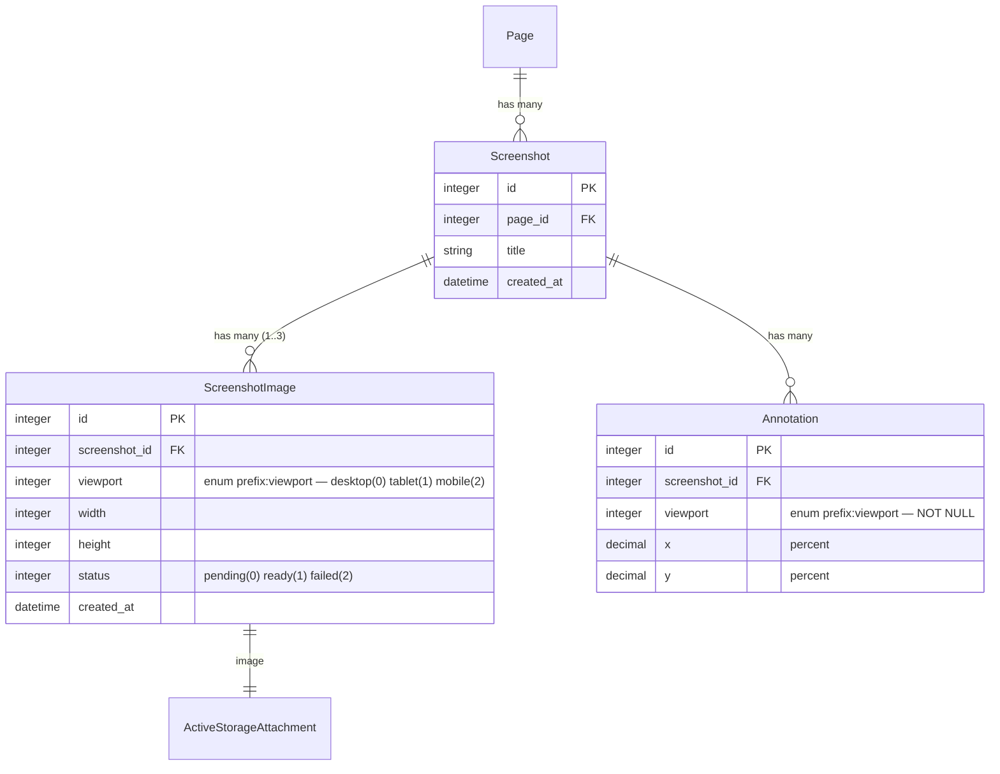

# feat: Multi-viewport screenshot capture (desktop / iPad mini / mobile) with in-app device switcher

> Revised 2025-04-21 after parallel plan review from DHH, Kieran, and code-simplicity reviewers. All P1 revisions applied.

## Overview

The `/screenote` Claude Code skill captures three viewports by default — **Desktop 1280×800, iPad mini 768×1024, Mobile 390×844** — instead of the current single viewport. In the Screenote web UI, a three-icon toolbar lets users switch between viewport variants of one capture; each viewport has its own annotation set (annotations are scoped per-viewport because layouts genuinely differ at different widths).

**Mental model:** one **Screenshot** = one logical capture event on a Page. Each capture has up to 3 image renders (**ScreenshotImage** rows, one per viewport). Annotations belong to a `(screenshot, viewport)` pair.

## Problem Statement

Today Screenote captures one viewport per upload. Responsive bugs only reproduce at specific breakpoints, so reviewers either miss mobile-only issues or capture twice and end up with two disconnected screenshots whose feedback threads never rejoin. A multi-viewport capture + switcher closes the feedback loop for responsive design and matches the UX convention established by Chromatic, Storybook, Polypane, and Chrome DevTools' device mode.

## Proposed Solution

### Data model — new `ScreenshotImage` child model



Unique index on `(screenshot_id, viewport)` — one image per viewport per capture. Both enums declared with `prefix: :viewport` so predicates read `annotation.viewport_mobile?` and never collide with future booleans.

### Rationale vs alternatives (honest trade-off)

A reviewer pushed hard for three `has_one_attached :image_desktop / _tablet / _mobile` on `Screenshot` directly (let's call this "Option D"): fewer moving parts, no new table, no blob re-parenting. The counter-argument — and why this plan still chooses the child model — is narrow but real:

- **Per-variant status and retry** belong on a row, not on a parent. If the tablet render fails to analyze and needs a retry, it's a single row update; on Option D it would need a `tablet_status` column and a matching set of predicates.
- **Signed upload tokens** are per-record (ADR-011 uses `generates_token_for :upload` keyed on the attachment record). A child row gives each variant its own token without inventing a "token type" enum.
- **`ScreenshotDimensionJob`** already runs per-attachment. It stays a single-responsibility job (one ScreenshotImage per job) rather than gaining a viewport parameter.

Option D is defensible and ~30 lines shorter. This plan picks the child model; if implementation reveals the child model is wrong, switching to Option D is a one-day refactor since the reader call sites go through model helpers either way.

### MCP API — single schema

`CreateScreenshotTool` takes **one shape**: an array of viewports, each with an `image_path`. No hybrid legacy top-level `image_base64` param. No nested `attach_to_screenshot_id` races.

```ruby
# app/tools/create_screenshot_tool.rb
arguments do
  required(:project_id).filled(:integer)
  required(:title).filled(:string)
  optional(:page_name).filled(:string)
  required(:viewports).array(:hash) do
    required(:viewport).filled(:string)   # "desktop" | "tablet" | "mobile"
    required(:image_path).filled(:string) # path on the MCP server's filesystem
    optional(:mime_type).filled(:string)
  end
end
```

Returns `{ screenshot_id, page_id, annotate_url, viewports: { desktop: :ready, tablet: :pending, mobile: :pending } }`.

**Backward compat for callers still passing top-level `image_base64`:** a separate lightweight MCP tool `create_screenshot_legacy` wraps the new one (1–2 lines), emits a deprecation log, and removes in a follow-up. No dual-schema in one tool.

For the signed-upload flow (ADR-011), `create_screenshot_upload_tool` returns an array of `{ viewport, upload_url, token }` — one per requested viewport. Callers PUT binaries independently; the Screenshot aggregate is created atomically by the initial call.

### URL + UI

**Nested REST route** — each viewport is a canonical view of the same resource, not a filter:

```ruby
# config/routes.rb
resources :screenshots, only: %i[show edit update destroy] do
  member do
    get "viewports/:viewport", to: "screenshots#show",
        as: :viewport, constraints: { viewport: /desktop|tablet|mobile/ }
  end
  # ... existing annotations routes
end
```

Path helper: `screenshot_viewport_path(@screenshot, :mobile)` → `/screenshots/42/viewports/mobile`. Plain `/screenshots/42` still works and defaults to `:desktop` (or the first available viewport if desktop is missing).

**Turbo Frame switcher** — the canvas wraps in `turbo_frame_tag "screenshot_canvas"`. Icons are `link_to` with `data-turbo-action="advance"` so URL + browser back/forward + shareable links all work:

```erb
<%# app/views/screenshots/_viewport_switcher.html.erb %>
<nav class="viewport-switcher" role="tablist">
  <% @screenshot.available_viewports.each do |vp| %>
    <%= link_to icon_for(vp) + vp.to_s.humanize,
        screenshot_viewport_path(@screenshot, vp),
        class: "viewport-switcher__icon #{'viewport-switcher__icon--active' if vp == @active_viewport}",
        data: { turbo_frame: "screenshot_canvas", turbo_action: "advance" },
        role: "tab", aria: { selected: vp == @active_viewport } %>
  <% end %>
</nav>

<%= turbo_frame_tag "screenshot_canvas" do %>
  <%= render "canvas", screenshot_image: @screenshot_image, annotations: @annotations_for_viewport %>
<% end %>
```

Existing `annotorious_controller.js` already implements `disconnect() { this.anno.destroy() }`, so Turbo frame swaps re-initialize Annotorious cleanly (verified by repo research).

**Default viewport on load:** always `:desktop` (or the first available if desktop is missing). No "smartest viewport" computation — users expect the muscle memory of every other design tool.

**Legacy treatment:** for a Screenshot that only has `:desktop`, the switcher renders just one icon. `/screenshots/:id/viewports/mobile` on a desktop-only screenshot redirects to the default with `flash[:notice]`.

### Annotations: per-viewport, no translation

Confirmed against Chromatic, Percy, Polypane, Applitools — all per-snapshot. A pin at `x=40%, y=30%` on desktop points at whitespace on mobile; coordinate translation is a fool's errand.

- `Annotation` gains `viewport` enum (non-null after backfill) with `prefix: :viewport`
- `annotation_params` adds `:viewport` to permitted keys
- Creating annotation in UI infers viewport from the active tab
- `ListAnnotationsTool` accepts `viewport:` filter; `serialize_annotation` returns `viewport` field
- Cropping: `screenshot_image.crop_for(annotation)` — a model method that delegates to the existing `AnnotationCropService`. Callers (the `get_annotation` MCP tool) go through the model, not the service directly.

### Claude Code skill (`/screenote`)

First-time implementation of `.claude/skills/screenote/SKILL.md` (which the existing `plans/screenote-claude-code-skill.md` has planned but never landed). Multi-viewport by default:

```
For each viewport in [desktop, tablet, mobile]:
  pw__browser_resize(viewport.width, viewport.height)
  pw__browser_navigate(url)                # fresh nav per viewport (SPA safety)
  pw__browser_wait_for(network idle)
  pw__browser_take_screenshot(
    fullPage: false,
    filename: "/tmp/screenote-{viewport}-{timestamp}.png"
  )

create_screenshot(
  project_id, title,
  viewports: [{viewport: :desktop, image_path: ...}, {...}, {...}]
)
```

Serial (Playwright MCP shares one context). If the user opts into a specific single viewport (`/screenote <url> --viewport=mobile`), the skill still works — just one entry in the viewports array.

## Technical Approach

### Two phases (not five)

**Phase 1 — everything behind a feature-complete migration (one PR, one deploy):**
- New `ScreenshotImage` model + migration
- Add `viewport` column to `annotations` (nullable initially)
- Rake task `screenshots:backfill_viewports` (dry-run + apply) — uses **Rails-native** `blob.attach/detach`, not raw SQL. Creates one `ScreenshotImage(viewport: :desktop)` per existing Screenshot, moves the Active Storage attachment, copies width/height/status, and backfills every `Annotation.viewport` to `:desktop`. Idempotent so it's safe to re-run.
- Flip all 11 reader call sites to `screenshot.primary_image` / `screenshot.image_for(viewport)` in the same PR. No dual-read shim — the backfill must complete before merge.
- MCP `create_screenshot` accepts the new `viewports: [...]` shape; `create_screenshot_legacy` wraps it for single-image callers.
- UI switcher + Turbo Frame + nested route.
- Cache version bump (`AnnotationCropService::CACHE_VERSION` constant) so in-flight jobs keyed on the old structure don't serve stale crops during queue drain.

**Phase 2 — tighten the screws (one PR, one deploy, ~1 week after Phase 1):**
- `change_column_null :annotations, :viewport, false` once the migrate-verify cycle has confirmed zero NULLs
- Drop legacy columns/attachment from Screenshot (`image`, `width`, `height`, `status`)
- Remove `create_screenshot_legacy` + deprecation log

Rollback for Phase 1: down-migration detaches ScreenshotImage blobs and re-attaches to Screenshot. Documented in the Rake task. For Phase 2: re-add the columns; shim the readers. This is the last-resort case — Phase 2 only ships when Phase 1 has been stable for a week.

### Call sites to flip (Phase 1)

| File | Current | After |
|---|---|---|
| `app/views/screenshots/show.html.erb:21` | `image_tag @screenshot.image` | `image_tag @screenshot_image.image` (controller assigns `@screenshot_image` from the viewport param) |
| `app/views/screenshots/_screenshot_grid.html.erb:6` | `@s.image.variant(...)` | `@s.primary_image.variant(...)` (delegated to primary `ScreenshotImage`) |
| `app/views/screenshots/_form.html.erb:22` | `screenshot.image` preview | `screenshot.primary_image` |
| `app/views/projects/index.html.erb:40` | `s.image.variant(...)` | `s.primary_image.variant(...)` |
| `app/views/projects/show.html.erb:25` | `page.latest_screenshot.image.variant(...)` | `page.latest_screenshot.primary_image.variant(...)` |
| `app/controllers/api/screenshot_uploads_controller.rb:19, 42` | attach to Screenshot | attach to the matching ScreenshotImage |
| `app/controllers/api/v1/screenshots_controller.rb:15` | create Screenshot + attach | create Screenshot + ScreenshotImage(:desktop) + attach |
| `app/tools/create_screenshot_tool.rb:35-39` | single attach | loop over `viewports:`, create one ScreenshotImage per entry |
| `app/tools/get_annotation_tool.rb:21` | `screenshot.image.attached?` | `screenshot.image_for(annotation.viewport).image.attached?` |
| `app/services/annotation_crop_service.rb:18, 21, 32, 48, 51` | reads `@screenshot.*` | takes `ScreenshotImage`; invoked via `screenshot_image.crop_for(annotation)` |
| `app/jobs/screenshot_dimension_job.rb:5, 7, 12, 14` | operates on Screenshot | operates on ScreenshotImage |

### Model helpers on `Screenshot`

```ruby
def primary_image
  screenshot_images.find_by(viewport: :desktop) || screenshot_images.order(:viewport).first
end

def image_for(viewport)
  screenshot_images.find_by(viewport: viewport)
end

def available_viewports
  screenshot_images.order(:viewport).pluck(:viewport)
end

def default_viewport
  available_viewports.include?("desktop") ? "desktop" : available_viewports.first
end

# Computed status (replaces column in Phase 2)
def status
  statuses = screenshot_images.pluck(:status).uniq
  return :failed if statuses.include?("failed")
  statuses == ["ready"] ? :ready : :pending
end
```

### Viewport enum

```ruby
# app/models/screenshot_image.rb
enum :viewport, { desktop: 0, tablet: 1, mobile: 2 }, prefix: :viewport

# app/models/annotation.rb
enum :viewport, { desktop: 0, tablet: 1, mobile: 2 }, prefix: :viewport
```

Predicates read `annotation.viewport_mobile?`, `screenshot_image.viewport_desktop?`. Duplicated enum definition (domain concept, not DRY opportunity — per Kieran).

### Default viewport dimensions

Aligned with 2025 Playwright defaults / Storybook `INITIAL_VIEWPORTS`:

- **Desktop: 1280×800** (Playwright default; user's original 1440×900 was arbitrary)
- **iPad mini: 768×1024** (user's number, real iPad mini)
- **Mobile: 390×844** (Playwright iPhone 14 default; 375×812 is legacy iPhone SE/X)

Fixed constants for v1. Custom dimensions out of scope.

## Alternatives Considered

- **Option D — three `has_one_attached` on Screenshot** — defensible. Simpler. Rejected because per-variant status/retry and per-variant signed tokens are cleaner on child rows. Mentioned honestly above as the "one-day refactor-away-from" fallback.
- **Option A — viewport + snapshot_id on Screenshot** — rejected: list queries need GROUP BY; mismatches the Page/Version hierarchy plan.
- **Option C — `has_many_attached` with metadata labels** — rejected: unordered, unidiomatic, per-image validation awkward.
- **Coordinate translation for shared annotations** — rejected by all industry precedent (Chromatic, Percy, Applitools, Polypane). Layouts genuinely differ.
- **Query param `?viewport=mobile`** — rejected per DHH: viewport is a canonical view of the same resource, belongs in the path.
- **Stimulus `innerHTML` swap** — rejected: violates CLAUDE.md "prefer native Turbo."
- **Parallel Playwright capture** — rejected for v1: MCP plugin shares one context.
- **"Default viewport = most annotations"** — rejected as clever-for-cleverness (all three reviewers). Default `:desktop` always.
- **`AttachmentValidatable` concern** — rejected: 5 lines duplicated once isn't a concern. Extract when a third model appears.
- **Keyboard shortcuts (1/2/3)** and **digest mailer viewport context** — deferred from v1.

## Acceptance Criteria

### Functional
- [ ] `screenshot_images` table exists with `(screenshot_id, viewport, width, height, status)` and `has_one_attached :image`; unique index on `(screenshot_id, viewport)`
- [ ] Every existing Screenshot has exactly one `ScreenshotImage(viewport: :desktop)` after backfill; zero data loss (verified by blob count + variant cache re-generation)
- [ ] Every existing Annotation has `viewport: :desktop` after backfill; Phase 2 marks the column NOT NULL
- [ ] `create_screenshot` MCP tool accepts `viewports: [{viewport:, image_path:}]` with 1–3 entries; `create_screenshot_legacy` wraps it with a deprecation log for single-image callers
- [ ] Opening `/screenshots/:id` renders the `:desktop` variant (or first available)
- [ ] Opening `/screenshots/:id/viewports/mobile` renders the mobile variant via Turbo Frame; browser back button returns to the previous viewport
- [ ] `/screenshots/:id/viewports/mobile` on a desktop-only screenshot redirects to the default with a flash notice
- [ ] Annotations drawn while viewport=mobile are saved with `viewport: :mobile` and hidden when the active viewport is :desktop
- [ ] `/screenote <url>` skill captures three viewports serially and uploads them as one Screenshot
- [ ] Grid / dashboard thumbnails render the `:desktop` variant (or first available)
- [ ] `ListAnnotationsTool` accepts optional `viewport:` filter; `serialize_annotation` includes `viewport`
- [ ] `screenshot_image.crop_for(annotation)` returns a crop from the correct variant

### Non-Functional
- [ ] All existing tests pass after each phase (465+ tests currently)
- [ ] Rubocop + Brakeman green after each phase
- [ ] Show page eager-loads `screenshot.screenshot_images` + viewport-scoped annotations (no N+1)
- [ ] Signed upload tokens still expire in 5 minutes per ADR-011
- [ ] `ScreenshotDimensionJob` enqueues 3× per multi-viewport capture (accepted — Solid Queue handles it; monitor latency post-deploy)

### Test enumeration (specific, per Kieran)
- [ ] `ScreenshotImage` model test (content-type + size validations, unique per viewport, generates_token_for :upload, status transitions)
- [ ] Backfill rake task idempotency — running twice must be a no-op on the second pass
- [ ] Turbo frame swap preserves Annotorious state: draw annotation on desktop → switch to mobile → switch back → original annotation still visible, Annotorious responsive
- [ ] Drawing annotation while `viewport=mobile` active persists `viewport: :mobile` in the DB and renders only when active viewport is mobile
- [ ] `/screenshots/:id/viewports/mobile` on desktop-only screenshot → redirect + flash
- [ ] Legacy MCP path (`create_screenshot_legacy` wrapper) still creates a Screenshot + one `:desktop` ScreenshotImage
- [ ] Cascade delete: destroy Screenshot → ScreenshotImages destroyed → Annotations destroyed
- [ ] `screenshot_image.crop_for(annotation)` cache key includes the variant's blob checksum (separate crops per viewport, no collision)

## Edge Cases (11 gaps from spec-flow analysis)

| # | Case | Plan |
|---|---|---|
| 1 | Agent uploads 1 or 2 viewports (timeout) | Partial capture is valid; missing viewport rows just don't render their icons |
| 2 | `/viewports/mobile` on legacy desktop-only | Redirect to default with flash notice |
| 3 | Viewport deleted / re-captured — annotations orphaned? | Re-capture creates a NEW Screenshot (matches Page/Version plan). Individual ScreenshotImage delete cascades its annotations (user-initiated = explicit) |
| 4 | Grid/index thumbnail | `:desktop` variant (or first available) |
| 5 | Web UI single-image upload | Continues to work; creates Screenshot + one `:desktop` ScreenshotImage. Multi-viewport web upload out of scope |
| 6 | Invitation-based collaborators | Same switcher as owners |
| 7 | Re-capture idempotency | New Screenshot per call (matches Page/Version plan) |
| 8 | `get_annotation_tool` cache key | Uses `screenshot_image.image.blob.checksum` (variant-scoped); `AnnotationCropService::CACHE_VERSION` constant bumped in Phase 1 deploy |
| 9 | AnnotationCropService dimensions | Now takes `ScreenshotImage`; called via `screenshot_image.crop_for(annotation)` |
| 10 | Digest mailer | Viewport context **deferred**. Existing copy is fine for v1 |
| 11 | Web-UI per-viewport replace | Out of scope for v1 |

## Dependencies & Risks

| Risk | Mitigation |
|---|---|
| Active Storage blob re-parenting (Rails-native) — `blob.attach/detach` inside a Rake task, not raw SQL in a migration | Rake task with `--dry-run` default (mirrors `stripe:reconcile_subscriptions`); run in prod with `--apply` under a maintenance-window banner for the ~1 min re-attachment period |
| Variant cache orphaning during attachment move | Rake task purges old variants (`blob.variant_records.destroy_all`) before re-attach; `AnnotationCropService::CACHE_VERSION` bump in the deploy forces all crops to regenerate |
| NOT NULL constraint on `annotations.viewport` during Phase 2 deploy | Two-phase sequencing: add nullable + backfill in Phase 1; make NOT NULL in Phase 2 after confirming zero NULLs via a verification query in the Phase 2 pre-deploy hook |
| Todo #001 P1 — weak Screenshot upload validation amplified 3× | ScreenshotImage gets its own content-type + size validators (duplicated, not extracted) |
| Turbo Frame is a NEW pattern in this repo | Add `wiki/patterns.md` entry with the frame-swap idiom after Phase 1 lands |
| `ScreenshotDimensionJob` × 3 per capture — enqueue storm on bulk uploads | Single-capture is 3 jobs, acceptable. If bulk scenarios emerge, add a single `ScreenshotImageBatch` job later |
| Annotorious state during frame swap | Existing `disconnect()` handles it; regression test covers draw-while-switching |

## References & Research

### Internal
- `app/models/screenshot.rb` — current model, acceptable_image validator pattern
- `app/models/annotation.rb` — percentage-based coords (ADR-005)
- `app/controllers/api/screenshot_uploads_controller.rb:19, 42` — signed-upload PUT
- `app/tools/create_screenshot_tool.rb` — current single-image MCP tool
- `app/tools/create_screenshot_upload_tool.rb` — signed URL generator
- `app/tools/get_annotation_tool.rb` — annotation retrieval for agents
- `app/services/annotation_crop_service.rb` — cropping logic (kept; exposed via model method)
- `app/jobs/screenshot_dimension_job.rb` — per-ScreenshotImage in Phase 1
- `app/javascript/controllers/annotorious_controller.js:7-51, 23-30` — disconnect/connect already frame-safe
- `app/views/screenshots/show.html.erb:21` — primary canvas target
- `config/routes.rb:24-42` — existing screenshot routes; add nested `viewports` member route
- `wiki/decisions.md` ADR-005, ADR-009, ADR-011
- `plans/screenote-claude-code-skill.md` — implemented in this plan
- `plans/project-page-version-hierarchy.md` — adjacent in-flight plan; no conflict

### External
- Rails 8.1 Active Storage: https://guides.rubyonrails.org/active_storage_overview.html
- Rails 8.1 Direct Uploads: https://guides.rubyonrails.org/active_storage_overview.html#direct-uploads
- Turbo Frames + `data-turbo-action="advance"`: https://turbo.hotwired.dev/handbook/frames#promoting-a-frame-navigation-to-a-page-visit
- Playwright device descriptors (2025 defaults): https://github.com/microsoft/playwright/blob/main/packages/playwright-core/src/server/deviceDescriptorsSource.json
- Playwright emulation: https://playwright.dev/docs/emulation
- Chromatic viewport UX (per-snapshot annotation precedent): https://www.chromatic.com/docs/viewports/
- Storybook INITIAL_VIEWPORTS: https://storybook.js.org/docs/essentials/viewport

### Related Work
- `/screenote` Claude Code skill (planned, unimplemented): `plans/screenote-claude-code-skill.md` — lands as Phase 1
- Page/Version hierarchy (in-flight): `plans/project-page-version-hierarchy.md`
- Tech-debt #001 (weak upload validation, P1) — addressed by ScreenshotImage's own validators
