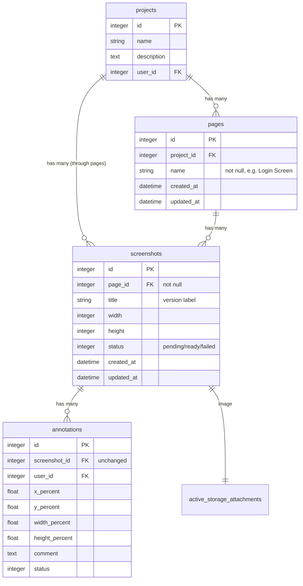

# feat: Add Page/Version hierarchy to organize screenshots

## Overview

Replace the flat Project -> Screenshots structure with a three-level hierarchy: **Project -> Page -> Version**. A "Page" represents a logical screen (e.g., "Login", "Dashboard"), and each page has ordered versions — each version is a screenshot upload with a timestamp or custom name.

**Example:** Project "Screenote", Page "Login", versions: "Initial design" (Feb 18), "After button fix" (Feb 19), "Final" (Feb 20).

## Problem Statement

Currently, uploading 10 screenshots of the same page creates 10 flat items in a project with no grouping. Users can't track iteration history, compare versions, or organize feedback by page. Agents uploading screenshots in a feedback loop create an ever-growing flat list with no context of what changed.

## Proposed Solution

### Data Model

```
Project
  └── Page (name)
        └── Screenshot (title/version_name, image, annotations)
```

**Key decision: Keep `screenshots` table name.** Renaming to `versions` or `page_versions` would require touching every controller, view, test, MCP tool, and job — massive churn for a naming preference. Instead, add a `page_id` foreign key to `screenshots` and add the new `pages` table. The mental model is "pages have screenshots (which are versions)."

**Key decision: Remove `project_id` from screenshots.** Use `has_many :screenshots, through: :pages` on `Project` instead of keeping a denormalized FK. All existing code calling `project.screenshots` keeps working through the `through:` association with zero data integrity risk.



### Page Model

```ruby
# app/models/page.rb
class Page < ApplicationRecord
  belongs_to :project
  has_many :screenshots, dependent: :destroy

  validates :name, presence: true, length: { maximum: 255 }
  validates :name, uniqueness: { scope: :project_id, case_sensitive: false }

  scope :ordered, -> { order(:created_at) }
end
```

### Screenshot Model Changes

```ruby
# app/models/screenshot.rb — changes
belongs_to :page
has_one :project, through: :page  # replaces direct belongs_to :project

delegate :project, to: :page  # for cases where screenshot.project is called directly
```

No `set_default_title` callback in the model. Default title generation happens in `CreateScreenshotTool` for agent uploads (using timestamp: `Time.current.strftime("%b %d, %Y %H:%M")`). Web UI always has a title field.

### Project Model Changes

```ruby
# app/models/project.rb — changes
has_many :pages, dependent: :destroy
has_many :screenshots, through: :pages  # replaces direct has_many :screenshots
```

### Routes

**Phase 0 prerequisite:** Rename existing `PagesController` (landing, help, terms, privacy) to `StaticPagesController` to free the `pages` resource name.

Use shallow nesting (Rails convention — max 2 levels):

```ruby
# config/routes.rb

# Static pages (renamed from PagesController)
root "static_pages#landing"
get "help", to: "static_pages#help"
get "terms", to: "static_pages#terms"
get "privacy", to: "static_pages#privacy"

# Resource routes
resources :projects do
  resources :pages, only: %i[new create]
end

resources :pages, only: %i[show edit update destroy] do
  resources :screenshots, only: %i[new create]
end

resources :screenshots, only: %i[show edit update destroy] do
  resources :annotations, only: %i[create update destroy]
end
```

**URL examples:**
- Project show (pages list): `/projects/:id`
- New page: `/projects/:project_id/pages/new`
- Page show (versions list): `/pages/:id`
- Upload version: `/pages/:page_id/screenshots/new`
- Version detail (annotation canvas): `/screenshots/:id`
- Create annotation: `/screenshots/:screenshot_id/annotations`

### Authorization Changes

The existing `ProjectAuthorization` concern finds projects via `params[:project_id]`. With shallow routes, `PagesController` member actions (`show`, `edit`, etc.) won't have `project_id` in params. Add a `set_page` helper that derives the project from the page:

```ruby
# In PagesController or a new PageScoped concern
def set_page
  @page = Page.find(params[:page_id] || params[:id])
  @project = Current.user.projects.find(@page.project_id)
end
```

Similarly, `ScreenshotsController` needs to derive the project from `@screenshot.page.project` for shallow routes. The `AnnotationsController` derives it from `@screenshot.project` via the through association.

### UI Structure

**Project show page** — replaces screenshot grid with page cards:

```
┌─────────────────────────────────────────────────┐
│ Screenote                      [+ New Page]     │
│ Visual feedback for AI agents                   │
├─────────────────────────────────────────────────┤
│ ┌───────────────┐  ┌───────────────┐            │
│ │ [thumbnail]   │  │ [thumbnail]   │            │
│ │               │  │               │            │
│ │ Login Screen  │  │ Dashboard     │            │
│ │ 3 versions    │  │ 1 version     │            │
│ │ 2 open        │  │ 0 open        │            │
│ └───────────────┘  └───────────────┘            │
└─────────────────────────────────────────────────┘
```

**Page show page** — version grid (newest first):

```
┌─────────────────────────────────────────────────┐
│ ← Screenote / Login Screen     [+ New Version]  │
├─────────────────────────────────────────────────┤
│ ┌───────────┐  ┌───────────┐  ┌───────────┐    │
│ │ [thumb]   │  │ [thumb]   │  │ [thumb]   │    │
│ │           │  │           │  │           │    │
│ │ Final     │  │ Button fix│  │ Initial   │    │
│ │ Today     │  │ Yesterday │  │ 5 days ago│    │
│ │ 2 open    │  │ 0 open    │  │ 1 open    │    │
│ └───────────┘  └───────────┘  └───────────┘    │
└─────────────────────────────────────────────────┘
```

**Screenshot show page** — same annotation canvas, updated breadcrumb:

```
┌─────────────────────────────────────────────────┐
│ ← Screenote / Login Screen / Final              │
│ [Canvas + Annotations — unchanged]              │
└─────────────────────────────────────────────────┘
```

### MCP Tool Changes (MVP scope)

Only two MCP tool changes for MVP. Other tools can be enriched with page fields in a follow-up with zero breaking changes.

1. **`create_screenshot`** — add optional `page_name` parameter (not `page_id`, to keep it human-friendly):
   - If `page_name` provided: `find_or_create_by!(name: page_name)` on the project, then add screenshot as new version
   - If `page_name` omitted: auto-create a new page using the screenshot title via `find_or_create_by!(name: title)`
   - This means agents uploading with the same title automatically group into the same page

2. **NEW `list_pages`** — list pages in a project with version counts and annotation stats.

**Deferred MCP changes (follow-up):**
- Add `page_id`, `page_name` to `list_screenshots`, `list_annotations`, `get_annotation` responses
- Add `page_id` filter to `list_screenshots` and `list_annotations`

### Migration Strategy

**Two migrations** (not four — this is a small app):

```ruby
# Migration 1: Create pages table
class CreatePages < ActiveRecord::Migration[8.1]
  def change
    create_table :pages do |t|
      t.references :project, null: false, foreign_key: true, index: true
      t.string :name, null: false
      t.timestamps
    end

    add_index :pages, "project_id, LOWER(name)", unique: true,
              name: "index_pages_on_project_id_and_lower_name"
  end
end
```

```ruby
# Migration 2: Add page_id to screenshots, backfill, enforce NOT NULL, drop project_id
class AddPageToScreenshots < ActiveRecord::Migration[8.1]
  # Local stubs to avoid using application model classes
  class Page < ApplicationRecord; end
  class Screenshot < ApplicationRecord; end

  def up
    add_reference :screenshots, :page, null: true, foreign_key: true, index: true

    # Backfill: create one page per screenshot (1:1 migration)
    # Handle duplicate names within a project by appending counter
    seen = Hash.new(0)  # { [project_id, lowercase_name] => count }

    Screenshot.find_each do |screenshot|
      key = [screenshot.project_id, screenshot.title.downcase]
      seen[key] += 1
      name = seen[key] > 1 ? "#{screenshot.title} (#{seen[key]})" : screenshot.title

      page = Page.create!(
        project_id: screenshot.project_id,
        name: name,
        created_at: screenshot.created_at,
        updated_at: screenshot.updated_at
      )
      screenshot.update_column(:page_id, page.id)
    end

    change_column_null :screenshots, :page_id, false
    remove_reference :screenshots, :project, foreign_key: true, index: true
  end

  def down
    add_reference :screenshots, :project, null: true, foreign_key: true, index: true

    Screenshot.find_each do |screenshot|
      page = Page.find(screenshot.page_id)
      screenshot.update_column(:project_id, page.project_id)
    end

    change_column_null :screenshots, :project_id, false
    remove_reference :screenshots, :page, foreign_key: true, index: true

    Page.delete_all
    drop_table :pages if Page.table_exists?
  end
end
```

## Acceptance Criteria

### Phase 0: Rename Static PagesController

- [ ] **Rename `PagesController`** to `StaticPagesController` — `app/controllers/static_pages_controller.rb`
- [ ] **Update routes** for landing, help, terms, privacy — `config/routes.rb`
- [ ] **Update any view references** to pages controller paths
- [ ] **All existing tests pass** after rename

### Core

- [ ] **Page model** exists with `name`, `project_id` — `app/models/page.rb`
- [ ] **Screenshot belongs_to page** (no direct `project_id` FK) — `app/models/screenshot.rb`
- [ ] **Project has_many screenshots through pages** — `app/models/project.rb`
- [ ] **Project show** displays page cards (thumbnail, name, version count, open annotation count) — `app/views/projects/show.html.erb`
- [ ] **Page show** displays version grid ordered newest-first (thumbnail, title, date, open count) — `app/views/pages/show.html.erb`
- [ ] **Screenshot show** has breadcrumb: Project > Page > Version — `app/views/screenshots/show.html.erb`
- [ ] **New page form** with name field — `app/views/pages/new.html.erb`
- [ ] **New version form** on existing page with screenshot upload + optional title — `app/views/screenshots/new.html.erb`
- [ ] **Shallow routes** with max 2 levels of nesting — `config/routes.rb`
- [ ] **Authorization** derives project from page for shallow routes — `app/controllers/concerns/`

### MCP Tools

- [ ] **`create_screenshot`** accepts optional `page_name`; uses `find_or_create_by!` for page grouping — `app/tools/create_screenshot_tool.rb`
- [ ] **`list_pages`** new tool returns pages with version counts — `app/tools/list_pages_tool.rb`

### Data Migration

- [ ] **Migration creates `pages` table** with case-insensitive unique index on `(project_id, name)`
- [ ] **Migration adds `page_id`** to screenshots, backfills, enforces NOT NULL
- [ ] **Migration removes `project_id`** from screenshots
- [ ] **Existing screenshots** each get their own page (1:1 migration)
- [ ] **Duplicate page names** within project are resolved with counter suffix
- [ ] **Migration is reversible** with working `down` method

### Tests

- [ ] **Page model tests** — validations, associations, case-insensitive uniqueness — `test/models/page_test.rb`
- [ ] **Screenshot model tests** — updated for page association, project through — `test/models/screenshot_test.rb`
- [ ] **Pages controller tests** — CRUD, authorization via project membership — `test/controllers/pages_controller_test.rb`
- [ ] **MCP tool tests** — `create_screenshot` backward compat (no page_name), find-or-create with page_name — `test/tools/`
- [ ] **Authorization test** — user cannot access `/pages/:id` for a project they are not a member of
- [ ] **Cascade deletion test** — deleting page destroys screenshots and annotations
- [ ] **Page fixtures** added — `test/fixtures/pages.yml`

## Technical Considerations

### What's NOT in scope (MVP)

- Version comparison/diff view (future)
- Drag-and-drop page reordering (future — add `position` column then)
- Copying annotations across versions (future)
- Page search/filter (future)
- Page archiving/soft delete (future)
- Page description field (future)
- Page edit/update actions (future — create, show, destroy only for MVP)
- API v2 endpoints (future — v1 stays with backward compat additions)
- OAuth scope changes (keep existing scopes, they still work)
- Enriching `list_screenshots`, `list_annotations`, `get_annotation` with page fields (follow-up)

### Performance

- Page cards query: `LEFT JOIN` for annotation counts (same pattern as current screenshot grid)
- Version list: `LEFT JOIN` for annotation counts per version
- Rely on single-column indexes from `add_reference` — add composite indexes when real slow queries appear

### Authorization

- Page permissions follow project membership (no page-level permissions)
- Only project owners can delete pages
- All project members can create pages and upload versions
- API key access to pages is inherited from project scope

### Quota

- Count total screenshots (versions) against existing limits, not pages
- A page with 5 versions counts as 5 against quota

## Implementation Phases

### Phase 0: Rename Static PagesController
1. Rename `app/controllers/pages_controller.rb` to `app/controllers/static_pages_controller.rb`
2. Rename class `PagesController` to `StaticPagesController`
3. Update routes: `root "static_pages#landing"`, etc.
4. Update any helpers or view references
5. Run tests, commit separately

### Phase 1: Models and Migrations
1. Create `pages` table migration with case-insensitive unique index
2. Add `page_id` to screenshots, backfill, enforce NOT NULL, remove `project_id` — single migration with local model stubs
3. Create `Page` model with validations and associations
4. Update `Screenshot` model: `belongs_to :page`, `has_one :project, through: :page`
5. Update `Project` model: `has_many :pages`, `has_many :screenshots, through: :pages`
6. Add page fixtures, model tests (including cascade deletion)

### Phase 2: Controllers and Routes
1. Add shallow nested routes for pages and screenshots
2. Create `PagesController` (show, new, create, destroy)
3. Add `set_page` authorization that derives project from page
4. Update `ScreenshotsController` to scope through pages, derive project from page
5. Update `AnnotationsController` to derive project from screenshot's page
6. Update `ProjectsController#show` to load pages instead of screenshots
7. Add controller tests including authorization for shallow routes

### Phase 3: Views and UI
1. Replace screenshot grid on project show with page cards
2. Create page show view with version grid (newest first)
3. Create new page form (name only)
4. Create new version form (screenshot upload for existing page, reuse existing upload form pattern)
5. Update screenshot show breadcrumbs (Project > Page > Version)
6. Update navigation and empty states
7. Add e2e system tests

### Phase 4: MCP Tools
1. Create `ListPagesTool`
2. Update `CreateScreenshotTool` with optional `page_name` + `find_or_create_by!` logic
3. Default title in tool: `Time.current.strftime("%b %d, %Y %H:%M")` when title omitted
4. Add MCP tool tests (backward compat without page_name, grouping with page_name)

## References

### Internal
- `app/models/project.rb` — current project model
- `app/models/screenshot.rb` — model getting `page_id` FK
- `app/controllers/pages_controller.rb` — MUST RENAME to `static_pages_controller.rb` first
- `app/controllers/screenshots_controller.rb` — controller pattern to replicate for pages
- `app/controllers/concerns/project_authorization.rb` — needs `set_page` variant for shallow routes
- `app/views/screenshots/_screenshot_grid.html.erb` — grid partial to adapt for page cards
- `app/tools/create_screenshot_tool.rb` — MCP tool needing backward compat
- `app/tools/application_tool.rb` — base tool with `project_annotations` helper (joins through screenshot)
- `config/routes.rb` — current nested routes
- `db/schema.rb` — current schema

### External
- [Rails Routing Guide — Shallow Nesting](https://guides.rubyonrails.org/routing.html#shallow-nesting)
- [Strong Migrations gem](https://github.com/ankane/strong_migrations)
- [Figma Version History pattern](https://help.figma.com/hc/en-us/articles/360038006754-View-a-file-s-version-history)
