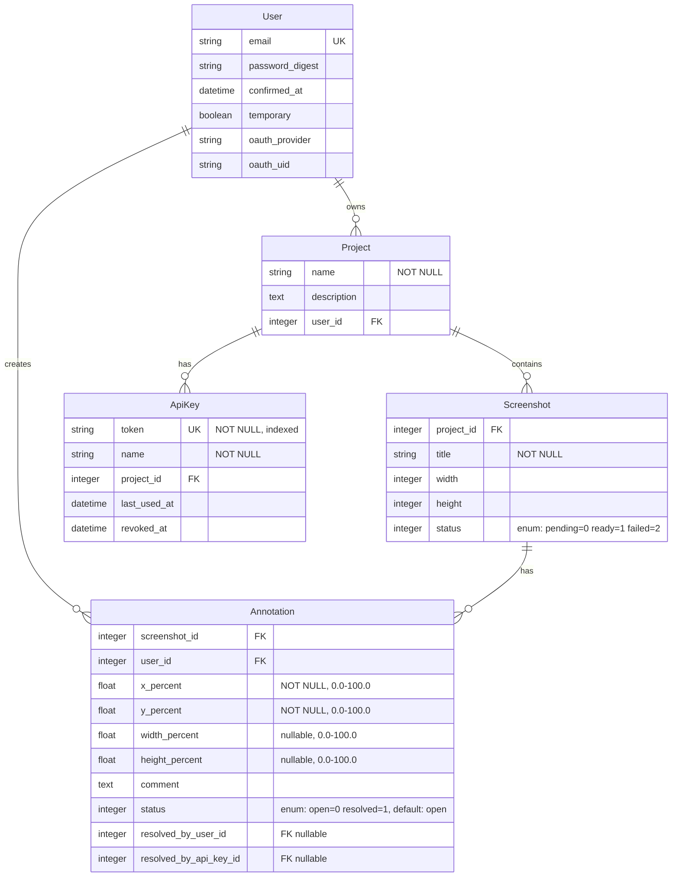

# Screenote: Visual Feedback Tool for AI Agents

## Overview

Screenote is a SaaS tool that lets users leave Figma-style visual comments on screenshots, then AI agents (like Claude Code) consume those comments via MCP **with the actual cropped image region** showing exactly what was commented on. This solves a key gap in Figma's API (coordinates only, no visual context) and creates the best tool for iterative design feedback loops with AI agents.

**Core value**: Human sees UI problem → annotates screenshot → AI agent sees annotation + visual context → AI fixes it → human reviews.

## Problem Statement

When working with AI agents on UI development:
- Figma's comment API provides coordinates but not what was visually commented on
- Text-only feedback loses critical visual context ("the button looks wrong" — which button? wrong how?)
- No tool exists that bridges visual feedback from humans to AI agents with actual image context
- Agents need both the comment text AND the visual region to understand and fix design issues

## Three Core Workflows

### Workflow 1: Upload Screenshot
```
User uploads image → annotates in browser → Agent collects via MCP
```
User has a screenshot (from browser dev tools, OS screenshot, etc). Uploads to Screenote, annotates, agent reads feedback.

### Workflow 2: Enter URL (server-side capture)
```
User enters URL → Screenote captures page → User annotates → Agent collects via MCP
```
For public URLs. Screenote server runs headless Chrome to capture the page. User annotates on the captured image.

### Workflow 3: Agent-initiated feedback (the killer feature)
```
Agent screenshots localhost → uploads to Screenote via MCP → returns link →
Human opens link, leaves comments → Agent collects comments + crops → Agent fixes → repeat
```
The agent drives the feedback loop. It already runs locally with access to `localhost:3000`, takes a screenshot (via Playwright MCP or similar), uploads it to Screenote, and gets back a URL for the human to annotate. No server-side Puppeteer needed for localhost — the agent handles capture locally.

**This is the tightest AI development loop**: agent builds UI → agent screenshots it → human reviews and comments → agent reads visual feedback → agent fixes → loop.

## Proposed Solution

A Rails 8 SaaS app with two interfaces:
1. **Human UI**: Upload screenshot or enter URL, annotate with Figma-style point/region comments
2. **MCP Server**: AI agents connect via HTTP with API key to:
   - **Upload** screenshots for human feedback (`create_screenshot`)
   - **Read** annotations with cropped image regions (`list_annotations`, `get_annotation`)
   - **Resolve** annotations after fixing (`resolve_annotation`)

## Technical Approach

### Stack

| Layer | Technology |
|-------|-----------|
| Framework | Rails 8.1+, Ruby 3.4+ |
| Auth | `rails_simple_auth` gem (email, magic link, Google/GitHub OAuth) |
| Frontend | Stimulus + Turbo, importmap (no build) |
| CSS | Vanilla CSS with BEM naming |
| Annotation UI | Annotorious v3 (vanilla JS, W3C standard, pinned version) |
| Image Storage | Active Storage + Rabata S3-compatible storage |
| Image Processing | ImageProcessing gem with libvips |
| MCP Server | FastMCP gem (Ruby, Rack middleware) |
| Background Jobs | Solid Queue |
| Cache | Solid Cache (Rails 8 native, database-backed) |
| Real-time | Turbo Streams + Action Cable |
| Deployment | Kamal |
| Error Tracking | Honeybadger |

### Architecture

```
Developer's Machine                        Screenote SaaS
┌──────────────┐                      ┌──────────────────────────────────┐
│ Claude Code  │ ──── HTTP + API ──── │          Rails 8 App              │
│  MCP Client  │      key auth        │                                    │
└──────────────┘                      │  Human Users ──► Web UI            │
                                      │  (Upload, Annotate, Review)        │
                                      │                                    │
                                      │  AI Agents ──► FastMCP (HTTP)      │
                                      │  (List, Get+Crop, Resolve)        │
                                      │                                    │
                                      │  Active Storage ──► Rabata S3      │
                                      └──────────────────────────────────┘
```

For **local development of Screenote itself**, `bin/mcp` STDIO transport connects to the same database as `bin/dev` — two processes, shared DB, no network needed.

### Data Model



**Database indexes:**

```ruby
# users
add_index :users, :email, unique: true

# projects
add_index :projects, :user_id

# api_keys
add_index :api_keys, :token, unique: true  # critical for MCP auth lookup
add_index :api_keys, :project_id

# screenshots
add_index :screenshots, :project_id

# annotations
add_index :annotations, [:screenshot_id, :status]  # list by status
add_index :annotations, :user_id
add_index :annotations, :resolved_by_user_id
add_index :annotations, :resolved_by_api_key_id
```

**Model validations:**

```ruby
class Project < ApplicationRecord
  validates :name, presence: true, length: { maximum: 255 }
end

class ApiKey < ApplicationRecord
  validates :token, presence: true, uniqueness: true
  validates :name, presence: true
end

class Screenshot < ApplicationRecord
  enum :status, { pending: 0, ready: 1, failed: 2 }, default: :pending

  validates :title, presence: true
  validates :width, :height, numericality: { only_integer: true, greater_than: 0 }, allow_nil: true
  validates :image, presence: true,
    content_type: ["image/png", "image/jpeg"],
    size: { less_than: 10.megabytes }
end

class Annotation < ApplicationRecord
  enum :status, { open: 0, resolved: 1 }, default: :open

  validates :x_percent, :y_percent, presence: true,
    numericality: { greater_than_or_equal_to: 0.0, less_than_or_equal_to: 100.0 }
  validates :width_percent, :height_percent,
    numericality: { greater_than: 0.0, less_than_or_equal_to: 100.0 }, allow_nil: true
  validate :region_within_bounds

  def point?
    width_percent.nil?
  end

  private

  def region_within_bounds
    return unless width_percent && x_percent
    if x_percent + width_percent > 100.0
      errors.add(:width_percent, "annotation extends beyond image boundary")
    end
    if height_percent && y_percent && y_percent + height_percent > 100.0
      errors.add(:height_percent, "annotation extends beyond image boundary")
    end
  end
end
```

**Key design decisions:**

1. **Coordinates as percentages** (0.0–100.0) relative to image dimensions — annotations stay aligned regardless of viewport size or zoom level
2. **Point annotations** store x_percent/y_percent only (width/height null) — `point?` derived from data, no `annotation_type` column needed
3. **Region annotations** store all four coordinates — validated to not exceed image bounds
4. **Integer-backed enums** for all status fields — faster indexing, self-documenting, typo-proof
5. **Proper foreign keys for resolved_by** — `resolved_by_user_id` (human via UI) or `resolved_by_api_key_id` (agent via MCP), not a freeform string
6. **API keys scoped to projects** — agents authenticate per-project via unique token

### MCP Integration Architecture

**Primary transport: HTTP** (SaaS — agents connect remotely)

```
Developer configures Claude Code MCP:
┌────────────────────────────────────────────────────────┐
│ // ~/.claude/claude_code_config.json                    │
│ {                                                        │
│   "mcpServers": {                                        │
│     "screenote": {                                       │
│       "type": "http",                                    │
│       "url": "https://screenote.app/mcp",                │
│       "headers": {                                       │
│         "Authorization": "Bearer sk_proj_abc123..."      │
│       }                                                  │
│     }                                                    │
│   }                                                      │
│ }                                                        │
└────────────────────────────────────────────────────────┘
```

**Auth at transport level** (not per-tool):
- HTTP: API key in `Authorization: Bearer <token>` header
- FastMCP middleware resolves `current_project` from the token before any tool executes
- Tools receive `current_project` context — no `project_api_key` parameter needed
- STDIO (for Screenote development only): `bin/mcp --token <key>` resolves project at startup

**MCP Tools exposed:**

```ruby
# Tool: create_screenshot (agent-initiated feedback — the killer feature)
# Input: { title: string, image_base64: string, mime_type: "image/png"|"image/jpeg" }
# Output: { screenshot_id, annotate_url }
# → Agent captures localhost page, uploads to Screenote, gets back a link for human to annotate
# → Agent can say: "I've deployed the changes. Please review and leave comments at: <annotate_url>"

# Tool: list_screenshots
# Input: { status?: "ready"|"pending"|"failed" }
# Output: [ { id, title, annotation_count, unresolved_count, annotate_url, created_at } ]

# Tool: list_annotations
# Input: { screenshot_id?: integer, status?: "open"|"resolved" }
# Output: [ { id, screenshot_id, type, coordinates, comment, status, created_at } ]

# Tool: get_annotation
# Input: { annotation_id: integer }
# Output: { annotation_data, cropped_image_base64, mime_type, crop_info }

# Tool: resolve_annotation
# Input: { annotation_id: integer }
# Output: { success: true, annotation: updated_data }
```

Tools are **thin wrappers** — they delegate to models immediately. No business logic in tool classes. Three lines: find record, call model/service method, return result.

**Agent-initiated workflow example:**
```
Agent: "Let me capture the current state for your review."
  → Agent uses Playwright MCP to screenshot localhost:3000/dashboard
  → Agent calls create_screenshot(title: "Dashboard v2", image_base64: "...")
  → Screenote returns { annotate_url: "https://screenote.app/s/abc123" }
Agent: "Please review and leave comments at: https://screenote.app/s/abc123"
  → Human opens link, sees screenshot, leaves Figma-style annotations
Agent: calls list_annotations(screenshot_id: 42, status: "open")
  → Gets 3 open annotations
Agent: calls get_annotation(annotation_id: 99)
  → Gets comment "Button text is too small" + cropped image of the button
Agent: fixes CSS, resolves annotation
  → Loop continues until all annotations resolved
```

### Image Cropping for MCP

```ruby
# app/services/annotation_crop_service.rb
class AnnotationCropService
  POINT_CROP_SIZE = 200  # px around point annotation
  REGION_PADDING = 50    # px padding around region
  MAX_DIMENSION = 1072   # optimal for Claude Vision

  def initialize(screenshot, annotation)
    @screenshot = screenshot
    @annotation = annotation
  end

  def self.crop(screenshot, annotation)
    new(screenshot, annotation).crop
  end

  def crop
    cache_key = "annotation_crop/#{@annotation.id}/#{@screenshot.image.blob.checksum}"

    Rails.cache.fetch(cache_key, expires_in: 1.hour) do
      image = ImageProcessing::Vips.source(@screenshot.image.download)
      result = @annotation.point? ? crop_point(image) : crop_region(image)
      Base64.strict_encode64(File.binread(result.path))
    end
  end

  private

  def crop_point(image)
    cx = (@annotation.x_percent / 100.0 * @screenshot.width).round
    cy = (@annotation.y_percent / 100.0 * @screenshot.height).round
    half = POINT_CROP_SIZE / 2

    left = [cx - half, 0].max
    top  = [cy - half, 0].max
    w    = [POINT_CROP_SIZE, @screenshot.width - left].min
    h    = [POINT_CROP_SIZE, @screenshot.height - top].min

    image
      .crop(left, top, w, h)
      .resize_to_limit(MAX_DIMENSION, MAX_DIMENSION)
      .call
  end

  def crop_region(image)
    x = (@annotation.x_percent / 100.0 * @screenshot.width).round
    y = (@annotation.y_percent / 100.0 * @screenshot.height).round
    w = (@annotation.width_percent / 100.0 * @screenshot.width).round
    h = (@annotation.height_percent / 100.0 * @screenshot.height).round

    left = [x - REGION_PADDING, 0].max
    top  = [y - REGION_PADDING, 0].max
    crop_w = [w + REGION_PADDING * 2, @screenshot.width - left].min
    crop_h = [h + REGION_PADDING * 2, @screenshot.height - top].min

    image
      .crop(left, top, crop_w, crop_h)
      .resize_to_limit(MAX_DIMENSION, MAX_DIMENSION)
      .call
  end
end
```

**Fixes applied from review:**
- Instance methods with class convenience method (`private` actually works now)
- Crop width/height accounts for clamped offset (prevents libvips overflow at image edges)
- Cache key includes blob checksum (auto-invalidates when screenshot changes)
- Uses Solid Cache (database-backed, Rails 8 native, no Redis needed)

### Authentication (rails_simple_auth)

Replicate the writero pattern:

```ruby
# config/initializers/rails_simple_auth.rb
RailsSimpleAuth.configure do |config|
  config.magic_link_enabled = true
  config.email_confirmation_enabled = true
  config.enable_oauth(google_oauth2: "Google", github: "GitHub")

  config.magic_link_expiry = 15.minutes
  config.session_expiry = 30.days
  config.password_minimum_length = 8

  config.after_sign_in_path = :root_path
  config.after_sign_out_path = :new_session_path
  config.layout = "auth"
  config.mailer_sender = ENV.fetch("MAILER_FROM", "noreply@screenote.app")
  config.mailer_class = "UserMailer"
end
```

**Key files from writero to reference** (at `../writero/`):
- `config/initializers/rails_simple_auth.rb` — gem configuration
- `config/initializers/omniauth.rb` — OAuth provider setup
- `app/models/user.rb` — `authenticates_with :confirmable, :magic_linkable, :oauth`
- `app/models/session.rb` — database-backed sessions
- `app/controllers/sessions_controller.rb` — custom with Turnstile
- `app/controllers/registrations_controller.rb` — custom signup
- `app/controllers/application_controller.rb` — `include Authentication`, `include SessionManagement`
- `app/mailers/user_mailer.rb` — branded emails

### Annotation UI (Figma-style)

**Annotorious v3** handles the heavy lifting:
- Click image to place point pin
- Click-drag to draw rectangle region
- W3C Web Annotation format
- No build step, works with importmap

```ruby
# config/importmap.rb — pin specific versions, not @latest
pin "@annotorious/annotorious", to: "https://cdn.jsdelivr.net/npm/@annotorious/annotorious@3.0.10/dist/annotorious.min.js"
```

Stimulus controllers (focused, single-responsibility):
- `annotorious_controller.js` — library initialization and event binding
- `annotation_form_controller.js` — annotation CRUD and form submission
- `upload_controller.js` — direct upload with preview

### Storage Configuration (Rabata S3)

```yaml
# config/storage.yml
rabata:
  service: S3
  access_key_id: <%= ENV["RABATA_ACCESS_KEY_ID"] %>
  secret_access_key: <%= ENV["RABATA_SECRET_ACCESS_KEY"] %>
  region: <%= ENV.fetch("RABATA_REGION", "eu-central-1") %>
  bucket: <%= ENV["RABATA_BUCKET"] %>
  endpoint: <%= ENV["RABATA_ENDPOINT"] %>
  force_path_style: true

local:
  service: Disk
  root: <%= Rails.root.join("storage") %>
```

```ruby
# config/environments/production.rb
config.active_storage.service = :rabata

# config/environments/development.rb
config.active_storage.service = :local
```

**Direct uploads** require CORS configuration on Rabata bucket — document in setup instructions.

### Screenshot Dimension Extraction

```ruby
# app/models/screenshot.rb
class Screenshot < ApplicationRecord
  has_one_attached :image

  after_create_commit :extract_dimensions_later

  private

  def extract_dimensions_later
    ScreenshotDimensionJob.perform_later(self)
  end
end

# app/jobs/screenshot_dimension_job.rb
class ScreenshotDimensionJob < ApplicationJob
  def perform(screenshot)
    return unless screenshot.image.attached?

    metadata = screenshot.image.blob.metadata
    screenshot.update!(
      width: metadata["width"],
      height: metadata["height"],
      status: :ready
    )
  end
end
```

## Implementation Phases

### Phase 1: Foundation (Rails app + Auth + Projects)

**Goal**: Working Rails 8 SaaS app with authentication, project CRUD, and tests.

Files to create:
- `Gemfile` — rails, rails_simple_auth, omniauth-google-oauth2, omniauth-github, image_processing, fast_mcp, resend
- `config/initializers/rails_simple_auth.rb`
- `config/initializers/omniauth.rb`
- `config/storage.yml` — Rabata S3 + local config
- `config/importmap.rb`
- `app/models/user.rb` — with authenticates_with concerns
- `app/models/session.rb`
- `app/models/project.rb`
- `app/models/current.rb` — delegates to RailsSimpleAuth::Current
- `app/controllers/application_controller.rb` — auth integration
- `app/controllers/projects_controller.rb` — CRUD
- `app/views/layouts/application.html.erb`
- `app/views/layouts/auth.html.erb`
- `app/views/projects/` — index, show, new, edit
- `app/mailers/user_mailer.rb`
- `db/migrate/` — users, sessions, projects tables
- `test/models/user_test.rb`
- `test/models/project_test.rb`
- `test/controllers/projects_controller_test.rb`

Acceptance criteria:
- [ ] `rails new screenote` with correct gems
- [ ] User can sign up with email/password
- [ ] User can log in with magic link
- [ ] User can log in with Google OAuth
- [ ] User can log in with GitHub OAuth
- [ ] User can create/view/edit/delete projects
- [ ] Auth views styled with BEM CSS
- [ ] Tests written for all models and controllers
- [ ] `bin/rubocop` passes
- [ ] `brakeman -q` passes
- [ ] `bin/rails test` passes

### Phase 2: Screenshots + Annotations

**Goal**: Users can upload screenshots and annotate them with Figma-style comments.

Files to create:
- `app/models/screenshot.rb` — Active Storage attachment, enum status, validations
- `app/models/annotation.rb` — coordinates, comment, enum status, validations
- `app/controllers/screenshots_controller.rb` — CRUD
- `app/controllers/annotations_controller.rb` — CRUD
- `app/services/annotation_crop_service.rb` — libvips cropping (instance-based)
- `app/jobs/screenshot_dimension_job.rb` — extract width/height after upload
- `app/views/screenshots/` — new (upload form), show (annotation canvas), index
- `app/views/annotations/` — partials, turbo stream templates
- `app/javascript/controllers/annotorious_controller.js` — library init + events
- `app/javascript/controllers/annotation_form_controller.js` — CRUD operations
- `app/javascript/controllers/upload_controller.js` — direct upload + preview
- `app/assets/stylesheets/components/annotation.css`
- `app/assets/stylesheets/components/screenshot.css`
- `db/migrate/` — screenshots and annotations tables with indexes
- `test/models/screenshot_test.rb`
- `test/models/annotation_test.rb`
- `test/services/annotation_crop_service_test.rb`
- `test/controllers/screenshots_controller_test.rb`
- `test/controllers/annotations_controller_test.rb`

Acceptance criteria:
- [ ] User can upload PNG/JPG screenshot (max 10MB) with direct upload
- [ ] Screenshot dimensions extracted after upload via background job
- [ ] User can click image to place point annotation
- [ ] User can click-drag to draw region annotation
- [ ] User can write comment text on annotation
- [ ] User can edit annotation comment
- [ ] User can delete annotation
- [ ] Annotations stored as percentage coordinates (validated 0.0–100.0)
- [ ] Region annotations validated to not exceed image bounds
- [ ] Annotations numbered sequentially on display
- [ ] Filter annotations by status (open/resolved)
- [ ] Real-time updates via Turbo Streams
- [ ] Annotation crop service produces correct image regions (including edge cases)
- [ ] Tests written for all models, services, and controllers
- [ ] `bin/rubocop` passes
- [ ] `bin/rails test` passes

### Phase 3: MCP Server (AI Agent Interface)

**Goal**: AI agents can connect via HTTP MCP, list annotations, get visual context, resolve.

Files to create:
- `app/models/api_key.rb` — project-scoped, unique token, validations
- `app/controllers/api_keys_controller.rb` — generate/revoke in project settings
- `app/views/api_keys/` — management UI within project settings
- MCP tool classes (following FastMCP conventions)
- `config/initializers/fast_mcp.rb` — MCP server config with auth middleware
- `bin/mcp` — STDIO entry point for local development
- `db/migrate/` — api_keys table with unique token index
- `test/models/api_key_test.rb`
- MCP integration tests

Acceptance criteria:
- [ ] User can generate API keys per project (with name)
- [ ] User can revoke API keys
- [ ] MCP server available at `/mcp` (HTTP) with API key auth in header
- [ ] Auth resolves `current_project` at transport level (not per-tool param)
- [ ] `create_screenshot` accepts base64 image, stores it, returns annotate_url
- [ ] `list_screenshots` returns project screenshots with annotation counts + annotate_urls
- [ ] `list_annotations` returns annotations filtered by status/screenshot
- [ ] `get_annotation` returns comment + base64 cropped image region
- [ ] `resolve_annotation` marks annotation resolved, records which API key resolved it
- [ ] Cropped images cached via Solid Cache (1 hour TTL, keyed by annotation+blob checksum)
- [ ] `bin/mcp --token <key>` works for local STDIO development
- [ ] Full agent-initiated loop works: agent screenshots → uploads → human annotates → agent collects
- [ ] MCP tool classes are thin wrappers (delegate to models immediately)
- [ ] Tests for all tools and auth flow
- [ ] `bin/rubocop` passes
- [ ] `bin/rails test` passes

### Phase 4: Production & Polish

**Goal**: Production-ready SaaS deployment.

Tasks:
- [ ] Kamal deployment config (`config/deploy.yml`)
- [ ] Honeybadger integration (server + JS)
- [ ] Rate limiting on MCP endpoints
- [ ] Loading states and empty states for all views
- [ ] User-friendly error messages (generic only, details to Honeybadger)
- [ ] Cleanup jobs (expired sessions, orphaned Active Storage blobs)
- [ ] System tests for critical flows (Capybara + Playwright)
- [ ] CLAUDE.md updated with final architecture
- [ ] Direct upload CORS setup documentation for Rabata
- [ ] `bin/rubocop` passes
- [ ] `brakeman -q` passes
- [ ] `bin/rails test` passes

### Future Phases (post-launch, driven by usage)

- Server-side URL capture (Workflow 2) — Grover/Puppeteer for public URLs, requires Chrome in Docker image
- Screenshot versioning (version_number, parent_id linking)
- Pan/zoom with Panzoom library
- Annotation threading/replies
- Team/collaboration features (project invites, roles)
- Browser extension for one-click screenshot + upload

## Environment Variables

```bash
# Auth
MAILER_FROM=noreply@screenote.app
RESEND_API_KEY=...
GOOGLE_CLIENT_ID=...
GOOGLE_CLIENT_SECRET=...
GITHUB_CLIENT_ID=...
GITHUB_CLIENT_SECRET=...

# Storage (Rabata S3)
RABATA_ACCESS_KEY_ID=...
RABATA_SECRET_ACCESS_KEY=...
RABATA_BUCKET=screenote-production
RABATA_REGION=eu-central-1
RABATA_ENDPOINT=https://s3.rabata.io

# Monitoring
HONEYBADGER_API_KEY=...
HONEYBADGER_JS_API_KEY=...
```

## Key Design Decisions

### SaaS with HTTP MCP transport
Screenote runs as a hosted service. AI agents connect via HTTP with API key authentication. No local server installation needed for end users. Developers configure Claude Code MCP settings to point to `https://screenote.app/mcp` with their project API key.

### Percentage coordinates (not pixels)
Annotations stored as `x_percent`, `y_percent`, `width_percent`, `height_percent` (0.0–100.0). Annotations align correctly regardless of viewport size, zoom level, or device. Client converts to pixels for rendering. Region annotations validated to not exceed image bounds.

### Integer-backed enums (not string columns)
All status/type fields use Rails `enum` with integer backing columns. Faster indexing, typo-proof, self-documenting. No freeform strings for state management.

### Instance-based services with class convenience methods
Services use instance methods so `private` actually works. Class-level `.crop()` delegates to `new(...).crop`. Testable with instance state.

### Transport-level auth (not per-tool)
MCP API key resolved once when agent connects (via `Authorization` header for HTTP, `--token` flag for STDIO). Tools receive `current_project` context. Keys never appear in tool parameters or call logs.

### On-demand cropping with Solid Cache
Image crops generated when MCP tool is called, cached via Solid Cache (database-backed, Rails 8 native, no Redis). Cache key includes blob checksum for automatic invalidation on screenshot change. 1-hour TTL.

### Proper foreign keys for resolved_by
Two nullable FKs: `resolved_by_user_id` (human via UI) and `resolved_by_api_key_id` (agent via MCP). Queryable, auditable, no ambiguous strings.

### Deferred features
URL capture, screenshot versioning, pan/zoom, and team collaboration are deferred to post-launch. Core value is upload → annotate → MCP → resolve. Ship that first, let usage drive what to add next.

## References

- [rails_simple_auth gem](https://github.com/ivankuznetsov/rails_simple_auth) — auth framework
- [Annotorious v3](https://annotorious.dev/) — image annotation UI library
- [FastMCP](https://github.com/yjacquin/fast-mcp) — Ruby MCP server gem
- [MCP Specification](https://modelcontextprotocol.io/specification/2025-11-25) — protocol spec
- [ImageProcessing gem](https://github.com/janko/image_processing) — libvips wrapper
- [Writero auth implementation](../writero/) — reference auth setup at `/home/asterio/Dev/writero/`
- [Figma Comments API](https://developers.figma.com/docs/rest-api/comments-types/) — what we improve upon
- [Solid Cache](https://github.com/rails/solid_cache) — Rails 8 database-backed cache
