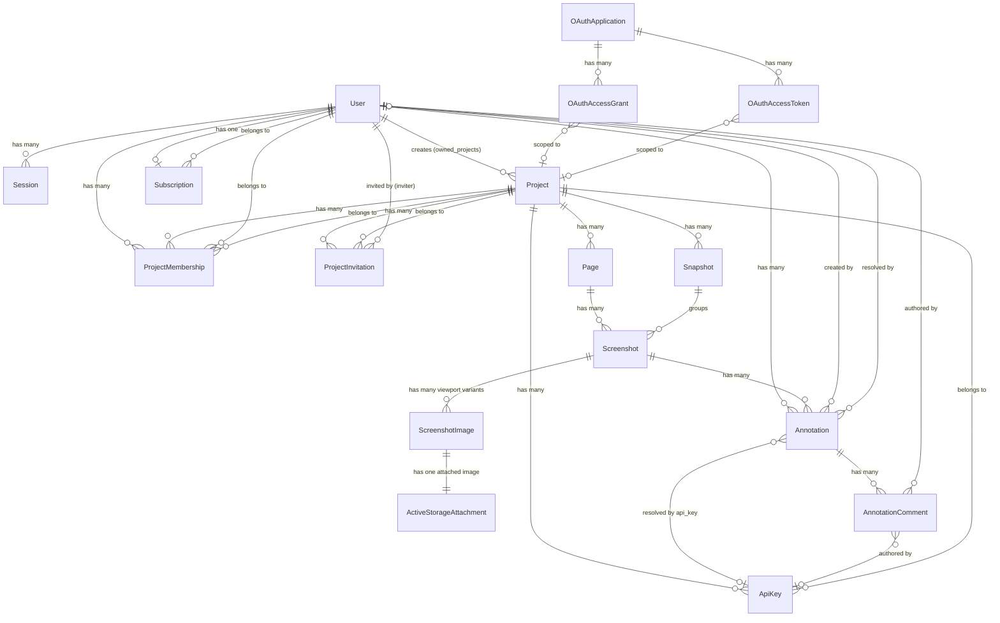

# Data Model

TLDR: Screenote has 14 application tables (plus 3 Active Storage tables and 3 Doorkeeper OAuth tables). The core hierarchy is User -> Project -> Page -> Screenshot -> ScreenshotImage, with Snapshot grouping screenshots captured during a `/snapshot` run and annotations scoped to a screenshot viewport. Collaboration is via ProjectMembership and ProjectInvitation. Billing is via Subscription and StripeWebhookEvent. API access is via ApiKey and Doorkeeper OAuth tokens.

Source: `db/schema.rb` (schema version `2026_07_10_120000`)

## ER Diagram

## Tables

### Core Domain

| Table | Purpose | Key Columns |
|-------|---------|-------------|
| `users` | User accounts with auth | email, password_digest, confirmed_at, oauth_provider, oauth_uid |
| `projects` | Top-level container | name, description, user_id (creator) |
| `pages` | Groups screenshots within a project | name, project_id |
| `snapshots` | Capture-run records for a project | project_id, git_commit, taken_at, optional manifest_digest |
| `screenshots` | Logical capture/version under a page | title, page_id, snapshot_id, optional manifest_entry_digest, derived status, legacy width/height during migration |
| `screenshot_images` | Per-viewport image variant | screenshot_id, viewport (enum), status (enum), content_sha256, expected_content_type, width, height |
| `annotations` | Feedback pinned to screenshot regions | x_percent, y_percent, width_percent, height_percent, viewport, comment, status (enum), screenshot_id, user_id |
| `annotation_comments` | Threaded comments on annotations | body, action (enum), annotation_id, user_id, api_key_id, notified_at |

### Collaboration

| Table | Purpose | Key Columns |
|-------|---------|-------------|
| `project_memberships` | User-project join table with roles | project_id, user_id, role (enum: member/owner) |
| `project_invitations` | Email-based invites with token | email, project_id, inviter_id, status (enum: pending/accepted) |

### Auth & Access

| Table | Purpose | Key Columns |
|-------|---------|-------------|
| `sessions` | Database-backed user sessions | user_id, ip_address, user_agent |
| `api_keys` | Bearer token auth for API/MCP | name, token_digest, token_prefix, project_id, revoked_at, last_used_at |

### Billing

| Table | Purpose | Key Columns |
|-------|---------|-------------|
| `subscriptions` | Stripe subscription state | user_id, stripe_customer_id, stripe_subscription_id, plan (enum), status (enum), current_period_end |
| `stripe_webhook_events` | Stripe webhook idempotency ledger | stripe_event_id |

### OAuth (Doorkeeper)

| Table | Purpose |
|-------|---------|
| `oauth_applications` | Registered OAuth clients (supports dynamic registration) |
| `oauth_access_grants` | Authorization codes with PKCE |
| `oauth_access_tokens` | Bearer tokens scoped to project |

### Active Storage

| Table | Purpose |
|-------|---------|
| `active_storage_blobs` | File metadata (S3 keys, checksums) |
| `active_storage_attachments` | Polymorphic join to models |
| `active_storage_variant_records` | Image variant tracking |

## Key Indexes

- `users.email` -- unique
- `pages.(project_id, LOWER(name))` -- unique, case-insensitive
- `snapshots.(project_id, taken_at)` -- powers the project-page "recent snapshots" sidebar (`Snapshot.recent` within a project scope). The id-equality `find_by(id:)` path used elsewhere is served by the PK, not this composite.
- `snapshots.(project_id, manifest_digest)` -- partial unique identity for resumable manifest-backed captures.
- `screenshots.snapshot_id` -- snapshot filtering
- `screenshots.(snapshot_id, manifest_entry_digest)` -- partial unique identity for prepared screenshot entries.
- `project_memberships.(project_id, user_id)` -- unique
- `api_keys.token_digest` -- unique
- `subscriptions.user_id` -- unique (one subscription per user)
- `subscriptions.stripe_customer_id` -- unique
- `stripe_webhook_events.stripe_event_id` -- unique
- `screenshot_images.(screenshot_id, viewport)` -- unique, one image per viewport per screenshot
- `annotations.(screenshot_id, status)` -- composite for filtered queries
- `annotations.(screenshot_id, viewport)` -- composite for per-viewport annotation views
- `annotation_comments.(annotation_id, created_at)` -- composite for ordered threads
- `annotation_comments.(action, notified_at)` -- for digest notification queries

## Foreign Key Cascade Rules

- `annotation_comments -> annotations`: ON DELETE CASCADE
- `annotation_comments -> users/api_keys`: ON DELETE SET NULL
- `annotations -> resolved_by_user`: ON DELETE SET NULL
- `annotations -> resolved_by_api_key`: ON DELETE SET NULL
- `oauth_access_grants/tokens -> oauth_applications`: ON DELETE CASCADE
- `oauth_access_grants/tokens -> projects`: ON DELETE SET NULL
- `screenshots -> snapshots`: ON DELETE SET NULL
- `screenshot_images -> screenshots`: no database cascade; Rails `dependent: :destroy` preserves Active Storage purge callbacks
- Duplicate snapshots for the same `(project_id, git_commit)` are allowed because repeated `/snapshot` captures of one commit can be useful at different times; `taken_at` distinguishes the runs.

See also: [[schema-evolution]], [[models/user]], [[models/project]], [[models/snapshot]], [[models/screenshot]], [[models/screenshot-image]], [[models/annotation]]
